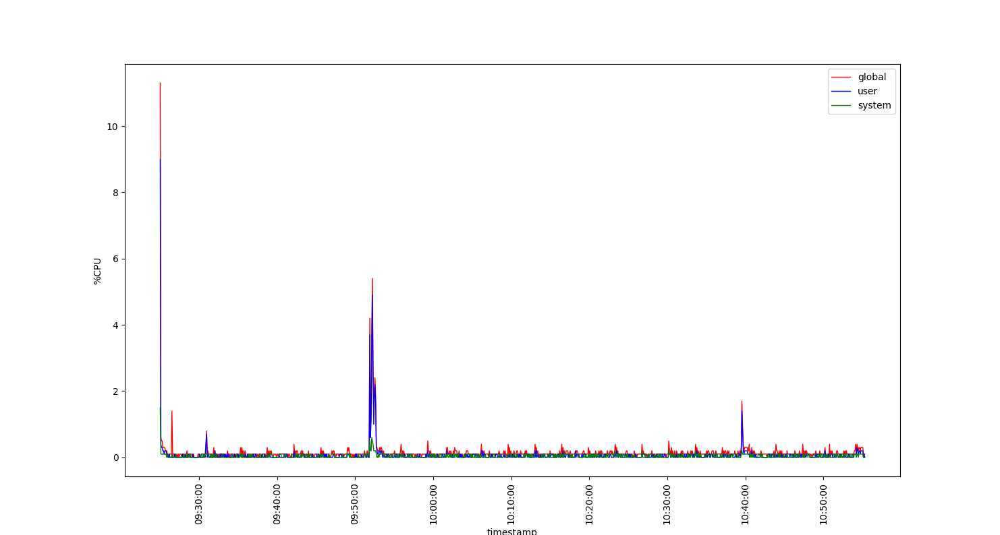
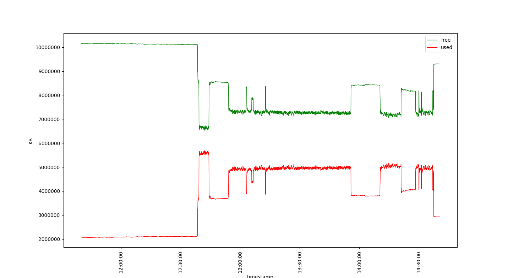

# Práctica Tema 2

Serafí Nebot Ginard

## Monitorización de la CPU

### ¿Cuántas CPUs tiene el sistema que se ha monitorizado? ¿De dónde se ha obtenido esa información?

8 CPUs

```
$ nproc --all
8
```

### ¿Cuál es la utilización media de la CPU en modo usuario, sistema y en global?

user mean: 0.07398148148148148 %

system mean: 0.04222222222222223 %

global mean: 0.1553703703703669 %

### ¿Cómo se comportan las medidas anteriores a lo largo del tiempo de observación? Muestra las tres métricas de forma gráfica.

La utilización de la CPU se mantiene bastante baja, entre el 0% y 2%, y estable durante todo el período de medición, exceptuando el pequeño pico de actividad que hay entre las 09:50 y las 10:00.
Las primeras mediciones son muy elevadas, probablemente debido a que el monitor top necesita un tiempo para estabilizar los valores medidos.



### ¿Cuál es la sobrecarga provocada por el monitor TOP?

## Monitorización de la memoria principal

### ¿Qué capacidad total tiene la memoria principal del sistema? ¿De dónde se ha obtenido ese dato?

12227312 kB

```
cat /proc/meminfo | head -n 1
MemTotal:       12227312 kB
```

### ¿Cuál es la utilización media de la memoria? ¿Y la capacidad media utilizada?

free mean: 8427075.826666666 KB

used mean: 3800236.1733333333 KB

### ¿Cómo se comporta la utilización de la memoria y la capacidad utilizada? Representa estas métricas gráficamente.

La utilización de la memoria tiene experimenta cambios muy bruscos, probablemente debido al encendido/apagado de programas. Como se aprecia en la gráfica, y es obvio por definición, la cantidad de memoria libre y usada tienen un comportamiento inverso, generando un efecto espejo sobre el eje horizontal.




### ¿Cuál es la sobrecarga provocada por el monitor VMSTAT?
