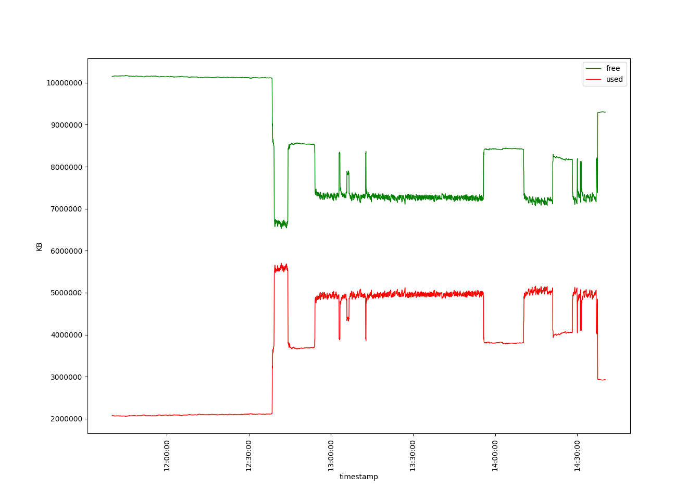
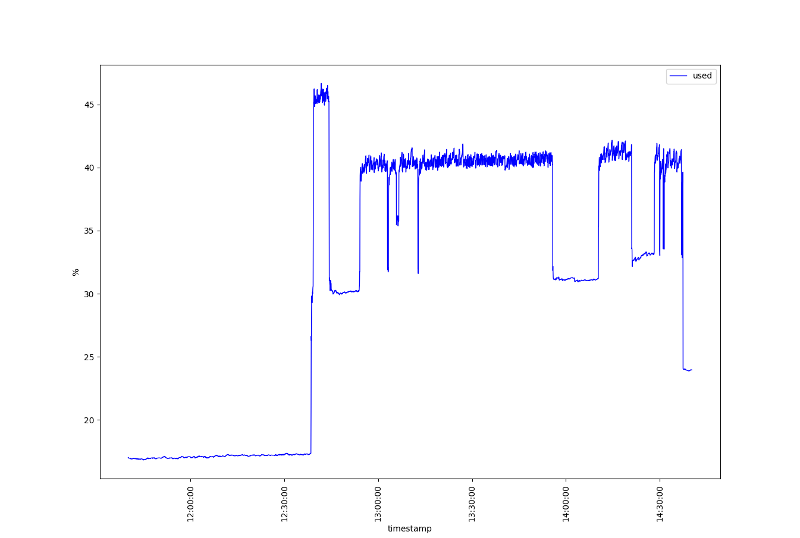
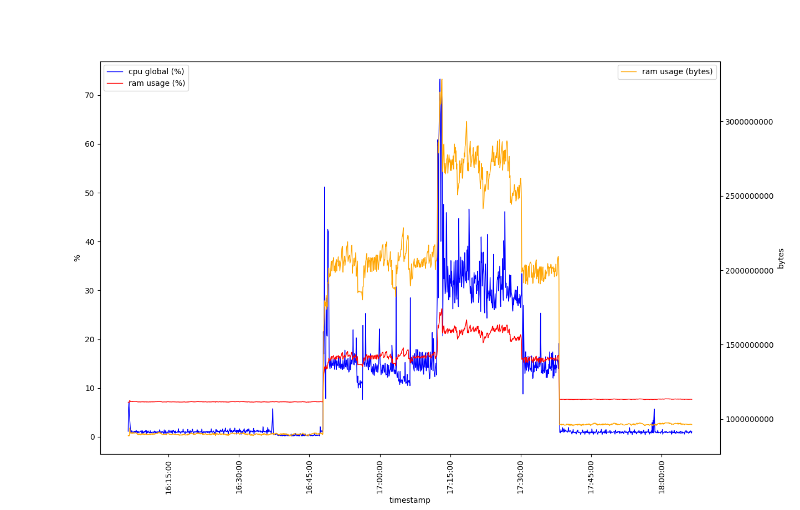



\pagebreak

# Monitorización de la CPU

El comando utilizado para la monitorización es el siguiente:

```bash
top -b -n 1080 -d 5 | awk '/^%Cpu\(s\):/ {print strftime("%Y-%m-%d %H:%M:%S"), $0}
```

## ¿Cuántas CPUs tiene el sistema que se ha monitorizado? ¿De dónde se ha obtenido esa información?

El sistema tiene 8 CPUs. Se ha obtenido con el siguiente comando:

```bash
$ nproc --all
8
```

## ¿Cuál es la utilización media de la CPU en modo usuario, sistema y en global?

* media usuario: `0.073981 %`
* media sistema: `0.042222 %`
* media global:  `0.155370 %`

## ¿Cómo se comportan las medidas anteriores a lo largo del tiempo de observación? Muestra las tres métricas de forma gráfica.

La utilización de la CPU se mantiene bastante baja, entre el 0% y 2%, y estable durante todo el período de medición, exceptuando el pequeño pico de actividad que hay entre las 09:50 y las 10:00.
Las primeras mediciones son muy elevadas, probablemente debido a que el monitor top necesita un tiempo para estabilizar los valores medidos.


## ¿Cuál es la sobrecarga provocada por el monitor TOP?

Ejecutando el siguiente unas varias veces podemos obtener el tiempo de ejecución de cada uno:

```bash
time top -b -n 1 -d 1 | awk '/^%Cpu\(s\):/ {print strftime("%Y-%m-%d %H:%M:%S"), $0}
```

Teniendo en cuenta varios resultados podemos calcular el tiempo medio de ejecución del monitor:

$$
\frac{0.168 + 0.170 + 0.171 + 0.180 + 0.183}{5} = 0.1744 \textrm{ ms}
$$

Esto significa que la sobrecarga del monitor es:

$$
\frac{T_{monitor}}{T_{medida}} = \frac{0.1744}{5} = 0.03488 = 3.488\%
$$

\pagebreak

# Monitorización de la memoria principal

El comando utilizado para la monitorización es el siguiente:

```bash
vmstat 3 3601 --unit K --wide | awk '{print strftime("%Y-%m-%d %H:%M:%S"), $4}'
```

## ¿Qué capacidad total tiene la memoria principal del sistema? ¿De dónde se ha obtenido ese dato?

La capacidad de memoria principal del sistema es de `12227312 KB`. Se ha obtenido con el siguiente comando:

```bash
$ cat /proc/meminfo | head -n 1
MemTotal:       12227312 kB
```

## ¿Cuál es la utilización media de la memoria? ¿Y la capacidad media utilizada?

* media memoria libre: `8427075.82 KB`
* media memoria utilizada: `3800236.17 KB`

## ¿Cómo se comporta la utilización de la memoria y la capacidad utilizada? Representa estas métricas gráficamente.

La utilización de la memoria experimenta cambios muy bruscos, probablemente debido al encendido/apagado de programas. Como se aprecia en la gráfica, y es obvio por definición, la cantidad de memoria libre y usada tienen un comportamiento inverso, generando un efecto espejo sobre el eje horizontal.





## ¿Cuál es la sobrecarga provocada por el monitor VMSTAT?

Ejecutando el siguiente unas varias veces podemos obtener el tiempo de ejecución de cada uno:

```bash
vmstat 3 3601 --unit K --wide | awk '{print strftime("%Y-%m-%d %H:%M:%S"), $4}'
```

Teniendo en cuenta varios resultados podemos calcular el tiempo medio de ejecución del monitor:

$$
\frac{0.001 + 0.002 + 0.002 + 0.001 + 0.002}{5} = 0.0016
$$

Esto significa que la sobrecarga del monitor es:

$$
\frac{T_{monitor}}{T_{medida}} = \frac{0.0016}{3} = 0.00053 = 0.053\%
$$

\pagebreak

# Monitorización en paralelo

En los anteriores apartados hemos utilizado `top` y `vmstat` para monitorizar la CPU y la RAM en modo *batch*. Debido a que necesitan un tiempo de estabilización (los primeros valores de ambos monitores no son fiables), no podemos utilizarlos en conjunto en nuestro script bash porque por cada iteración solo vamos a obtener el primer valor de cada monitor.

Para la CPU, he decidido utilizar la primera línea del archivo `/proc/stat` que indica el acumulado de utilización de la CPU en el siguiente formato (las unidades son *jiffies*, pero debido a que queremos un porcentaje esto es irrelevante):

```
cpu  user nice system idle iowait irq softirq steal guest guest_nice
```

Para obtener la utilización de cada campo durante el intervalo de tiempo que indiquemos, vamos a necesitar tomar una medida, esperar el intervalo de tiempo de monitorización, tomar otra medida y calcular la diferencia.

Si la utilización total, $U_t$, es la suma de todos los campos y $U_i$ es el campo idle, el porcentaje de utilización, $U$, es:

$$
U = \frac{U_t - U_i}{U_i} \cdot 100
$$

Para la RAM, he decidido utilizar el comando `free --bytes` que genera el siguiente resultado:

```bash
$ free --bytes
               total        used        free      shared  buff/cache   available
Mem:     12520767488   934035456 10130608128    43511808  1456123904 11316568064
Swap:     4294963200           0  4294963200
```

de donde podemos obtener la utilización actual:

```bash
$ free --bytes | sed -n '2p' | awk '{print $3}'
930934784
```

y calcular el porcentaje de utilización, $\frac{used}{total} \cdot 100$:

```bash
$ free --bytes | sed -n '2p' | awk '{print $3/$2*100}'
7.41111
```

He juntado estos dos monitores en un script bash para que se ejecuten cada 5 segundos, teniendo en cuenta el tiempo de ejecución de ambos monitores tomando el *epoch* en milisegundos antes y después de su ejecución con `date +%s%3N` para compensar el tiempo de monitorización y poder calcular el *overhead* para decidir el intervalo de monitorización:

```bash
#!/bin/bash

prev_line=$(grep '^cpu ' /proc/stat)

# time_start and time_end are used to calculate the amount of time it takes to execute the monitor
time_start=$(date +%s%3N)

# loop 1440 times (2 hours / 5 seconds per iteration = 7200 / 5 = 1440)
for i in $(seq 1 1440); do
    # calculate the time to sleep taking into account monitor execution time
    time_end=$(date +%s%3N)
    time_elapsed=$((time_end - time_start))
    # echo $time_elapsed ms
    time_sleep=$(echo "scale=3; 5 - ($time_elapsed) / 1000" | bc)
    sleep $time_sleep

    time_start=$(date +%s%3N)

    current_line=$(grep '^cpu ' /proc/stat)
    # sum all fields from user time onward (skip "cpu" label at $1)
    prev_total=$(echo "$prev_line" | awk '{sum=0; for(i=2; i<=NF; i++) sum+=$i; print sum}')
    # idle time is the 4th field after "cpu" (field $5)
    prev_idle=$(echo "$prev_line" | awk '{print $5}')

    # calculate total cpu time for current reading
    current_total=$(echo "$current_line" | awk '{sum=0; for(i=2; i<=NF; i++) sum+=$i; print sum}')
    current_idle=$(echo "$current_line" | awk '{print $5}')

    # compute differences between current and previous readings
    diff_total=$((current_total - prev_total))
    diff_idle=$((current_idle - prev_idle))

    # calculate cpu usage percentage
    # usage = ((total - idle) / total) * 100
    if [ "$diff_total" -gt 0 ]; then
        cpu_usage=$(echo "scale=2; ($diff_total - $diff_idle) * 100 / $diff_total" | bc)
    else
        cpu_usage=0
    fi

    # get ram usage in bytes from free command
    ram_line=$(free --bytes | sed -n '2p')
    ram_abs=$(echo $ram_line | awk '{print $3}')
    ram_percent=$(echo $ram_line | awk '{print $3/$2*100}')

    # print timestamp, cpu and ram usage
    printf "%s,%.4f,%u,%.4f\n" "$(date '+%Y-%m-%d %H:%M:%S')" $cpu_usage $ram_abs $ram_percent

    # update previous reading for the next iteration
    prev_line="$current_line"
done
```

Descomentando la línea que imprime el tiempo que tarda el monitor en milisegundos podemos obtener varias medidas para calcular la media y después calcular el overhead:

```
3 ms
2025-03-08 12:54:26,1.1500,925650944,7.3929
21 ms
2025-03-08 12:54:31,0.8500,917913600,7.3311
18 ms
2025-03-08 12:54:36,0.9400,918171648,7.3332
22 ms
2025-03-08 12:54:40,0.9200,918683648,7.3373
19 ms
2025-03-08 12:54:45,0.8700,919191552,7.3413
18 ms
2025-03-08 12:54:50,0.9200,918933504,7.3393
21 ms
```

Obviando la primera medida porque aún no se ha ejecutado el monitor, obtenemos una media de:

$$
T_{monitor} = \frac{21 + 18 + 22 + 19 + 18 + 21}{6} = 19.833 \textrm{ ms}
$$

Para escoger un intervalo de monitorización, $T_{intervalo}$, tal que el overhead sea menor que $10\%$:

$$
\frac{T_{monitor}}{T_{intervalo}} \cdot 100 < 10 \implies
\frac{T_{monitor}}{10} \cdot 100 < T_{intervalo}
$$

$$
T_{intervalo} > \frac{19.833}{10} \cdot 100 = T_{intervalo} > 198.33 \textrm{ ms}
$$

He escogido un $T_{intervalo}$ de $5000 \textrm{ ms}$, lo que implica un overhead de $\frac{19.833}{5000}\cdot100 = 0.39 \%$, muy por debajo del límite de $10\%$.

El siguiente gráfico representa el comportamiento de los valores monitorizados:



\pagebreak

# Pregunta voluntaria

## Expresar la fórmula de la sobrecarga de la monitorización cuando el monitor es basado en ‘detección de eventos’.

Para un intervalo de monitorización constante el overhead se puede calcular teniendo en cuenta sólo un intervalo de tiempo o la suma de todo el conjunto. Si $T_M$ es el tiempo de monitorización, $T_E$ el tiempo de ejecución y $T_I$ el intervalo de tiempo y $n$ el número de medidas, el overhead, $O$, es el siguiente:



$$
O = \frac{T_{M} \cdot n}{T_{I} \cdot n} = \frac{T_{M}}{T_{I}}
$$


Para un intervalo de monitorización variable (dirigido por eventos) se puede obtener el overhead calculando tiempo total de monitorización y el tiempo total de los intervalo entre eventos:



$$
O = \frac{\sum\limits_{i = 0}^{n} T_{M_i}}{\sum\limits_{i = 0}^{n} T_{I_i}}
$$
