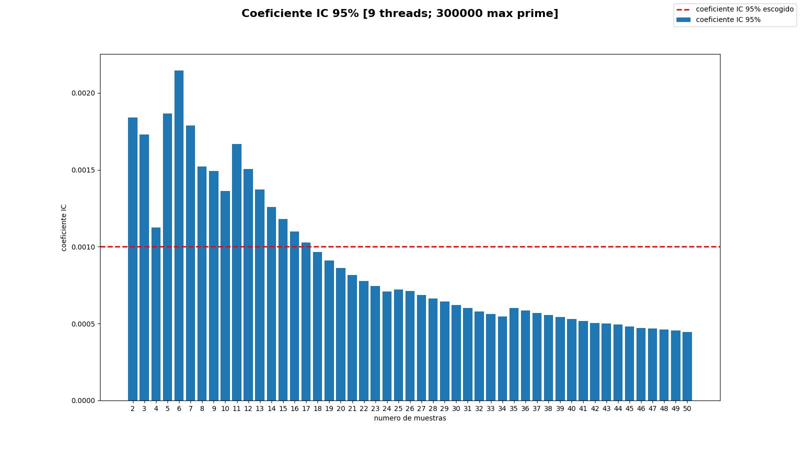
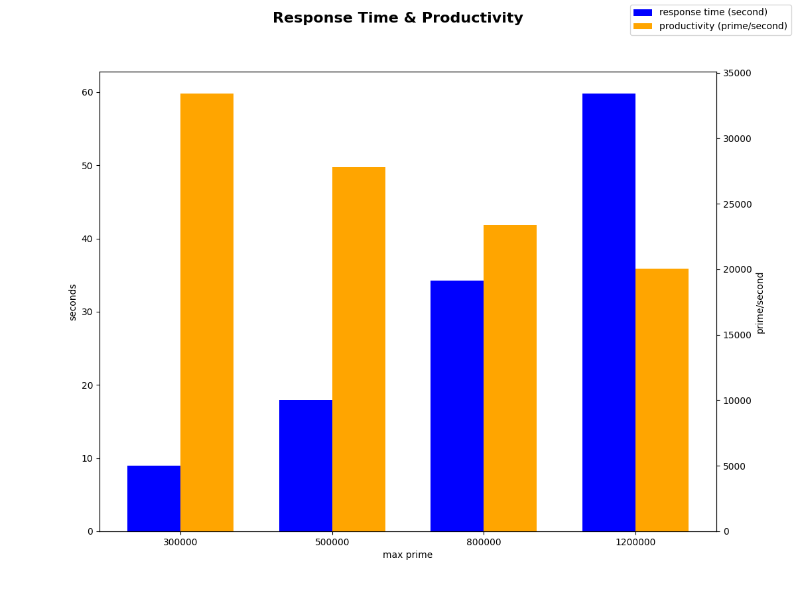
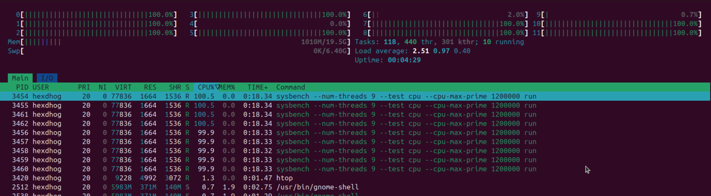
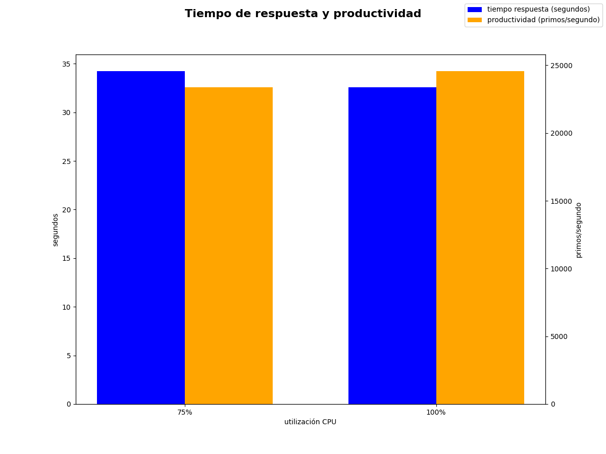
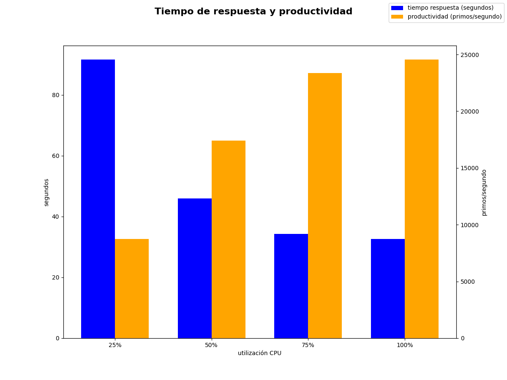

\pagebreak

# Sistema utilizado

El ordenador en el que he realizado toda la práctica tiene un total de 12 núcleos y 24GB de RAM. He utilizado VMWare Fusion 13.6.3 para cear una máquina virtual con 60GB de disco, 20GB de RAM y 12 núcleos de CPU.

Debido a que me he encontrado con muchos problemas para instalar Ubuntu 16.04, la versión preferible para realizar esta práctica porque se puede instalar una versión de Sysbench < 1.0 directamente, he decidio instalar Ubuntu 24.04.2 y compilar la versión 0.4.12 a partir del código fuente.

# Implementación del experimento

Para llevar a cabo los experimentos de forma automática he implementado los siguientes apartados, en los que expongo de forma general como he resuelto las diferentes partes del experimento, en un script de Python.

## Carga

Para aplicar una carga al sistema se ha utilizado el test de CPU de cálculo de numeros primos del Sysbench. Por ejemplo, para cargar la CPU al 75% ($12 \cdot 0.75 = 9$ núcleos) con el test de 100000 numeros primos:

```bash
$ sysbench --num-threads=9 --test=cpu --cpu-max-prime=100000 run
```
```
sysbench 0.4.12:  multi-threaded system evaluation benchmark

Running the test with following options:
Number of threads: 9

Doing CPU performance benchmark

Threads started!
Done.

Maximum prime number checked in CPU test: 100000


Test execution summary:
    total time:                          2.0681s
    total number of events:              10000
    total time taken by event execution: 18.5503
    per-request statistics:
         min:                                  1.60ms
         avg:                                  1.86ms
         max:                                 10.75ms
         approx.  95 percentile:               2.76ms

Threads fairness:
    events (avg/stddev):           1111.1111/16.87
    execution time (avg/stddev):   2.0611/0.00
```

Como el Sysbench ya nos proporciona el tiempo de respuesta (campo `total time`; primera linea del resumen de ejecución) no se necesita monitorizar el tiempo de ejecución del Sysbench.

En concreto, desde Python se crea un subproceso para el Sysbench, se monitoriza la CPU y la RAM cada segundo hasta que el subproceso termina, se captura la salida estándar y se obtiene el campo `total time` con expresiones regulares.

## Monitorización CPU

Para monitorizar el porcentaje de uso de la CPU se ha utilizado el la primera línea del archivo `/proc/stat`:

```bash
$ cat /proc/stat | head -n 1
cpu  12070 86 2074 516794 445 0 40 0 0 0
```

Que indica la cantidad de [*jiffies*](https://litux.nl/mirror/kerneldevelopment/0672327201/ch10lev1sec3.html) de CPU desde que se ha encendido el sistema con el siguiente formato: `cpu [user] [nice] [system] [idle] [iowait] [irq] [softirq] [steal] [guest] [guest_nice]`. Esto significa que la cantidad de jiffies total de CPU es la suma de todos los campos, la cantidad de jiffies que la CPU ha estado sin hacer nada es la suma de los campos `idle` y `iowait`, y la cantidad de jiffies que la CPU ha estado trabajando es la resta entre la cantidad total y la cantidad sin hacer nada.

Debido a que estos campos representan el acumulado hasta el momento, se debe calcular la diferencia de cada uno de los campos para cada intervalo de monitorización. Se puede calcular el porcentaje de utilización total de la CPU:

$$
U_{CPU} = \frac{(T_i - T_{i-1}) - (I_i - I_{i-1})}{T_i - T_{i-1}} \cdot 100 = 1 - \frac{I_i - I_{i-1}}{T_i - T_{i-1}} \cdot 100
$$

siendo $T_i$ la suma de todos los campos y $I_i$ la suma de los campos `idle` y `iowait`, en el instante $i$.

## Monitorización RAM

Para monitorizar la utilización de la memoria RAM se han utilizado la primera y tercara línea del archivo `/proc/meminfo`:


```bash
$ cat /proc/meminfo | head -n 3
MemTotal:       20433748 kB
MemFree:        18669952 kB
MemAvailable:   19156824 kB
```

Que indican la memoria total del sistema y la memoria disponible, respectivamente, en kilobytes ($1 \mathit{KB} = 2^{10} \mathit{B}$). Se utiliza `MemAvailable`, la capacidad disponible para utilizar, en lugar de `MemFree`, la capacidad directamente sin utilizar, porque su diferencia con `MemTotal` representa mejor la [cantidad total de memoria utilizada](https://unix.stackexchange.com/questions/666311/is-the-correct-way-to-calculate-the-total-memory-currently-being-used-to-subtrac).

A diferencia del archivo `/proc/stat`, son valores absolutos y no es necesario calcular las diferencias entre intervalos de monitorización. Se puede calcular el procentaje de utilización directamente:

$$
U_{RAM} = \frac{M_{TOTAL} - M_{AVAIL}}{M_{TOTAL}} \cdot 100
$$

siendo $M_{TOTAL}$ la memoria total del sistema y $M_{AVAIL}$ la memoria disponible.

## Sobrecarga de los monitores

Para simplificar los datos y los cálculos prefiero tener un intervalo de monitorización, $T_I$,  de 1 segundo, pero necesito saber si la sobrecarga, $O = \frac{T_M}{T_I}$, de los monitores sobre este intervalo de monitorización es aceptable. Para ello he utilizado la función `time()` del módulo time de Python para calcular el tiempo total de monitorización para cada iteración. Ejecutando los monitores a lo largo de unas 10 iteraciones he obtenido los siguientes tiempos:

```
0.000273, 0.000196, 0.000138, 0.000257, 0.000193, 0.000244, 0.000197, 0.000136, 0.000281, 0.000220
```

Calculando la media aritmética de todos estos valores obtenemos un tiempo de monitor de $T_M = 0.0002135 \mathit{s}$, a partir del cual podemos obtener el overhead:

$$
O = \frac{T_M}{T_I} = \frac{0.0002135}{1} = 0.0002135 \implies 0.02135 \%
$$

Un overhead de 0.02135% es bastante razonable, por lo que he decidio mantener un intervalo de monitorización de 1 segundo.

## Cálculo número de muestras

Para cada carga se han realizado múltiples ejecuciones y se ha calculado la media del tiempo de respuesta. Para estar seguros de que la media que obtenemos es "fiable", lo que se ha hecho es seguir haciendo ejecuciones hasta llegar a un coeficiente del intervalo de confianza del 95%, $\frac{IC}{\overline{R}}$, lo suficientemente pequeño.

Para determinar este coeficiente se ha ejecutado una carga de 300000 numeros primos unas 50 veces y se ha calculado el intervalo de confianza del 95% a partir de un conjunto de 2 muestras hasta llegar al conjunto completo de 50 muestras. La siguiente gráfica muestra el resultado de este proceso.



El coeficiente varía bastante con pocas muestras pero tiende a bajar y estabilizarse a medida que se va augmentando el número de muestras. He elegido un coeficiente de 0.001 (línea discontínua roja) porque he considerado que era un buen punto para separar las muestras iniciales, que son más caóticas, de las muestras ya estabilizadas. Además representa una variación del 0.1% sobre la media, que es un rango muy estrecho.

# Comportamiento del sistema con diferentes cargas

El tiempo de respuesta y la productividad para cada una de las cargas es el siguiente:

| Carga (max prime) | Tiempo Respuesta (s) | Productividad (prime/segundo) |
|-------------------|----------------------|-------------------------------|
| 300000            |  8.9799              | 33407.8948                    |
| 500000            | 17.9845              | 27801.6176                    |
| 800000            | 34.2338              | 23368.6993                    |
| 1200000           | 59.8041              | 20065.5030                    |

Que representado gráficamente queda de la siguiente forma:



Como se puede observar, el tiempo de respuesta incrementa de forma exponencial a medida que se va augmentando la carga. En cambio, la productividad tiene un comportamiento inverso al tiempo de respuesta. Como la productividad es $P = \frac{\textrm{carga}}{\textrm{tiempo respuesta}}$, esto significa que tiempo de respuesta crece más rápido que las diferentes cargas que hemos aplicado.

## Utilización de CPU y de RAM

La utilización media de CPU y RAM para cada una de las cargas es la siguiente:

| Carga (max prime) | Utilización CPU media (%) | Utilización RAM media (%) |
|-------------------|---------------------------|---------------------------|
| 300000            | 75.0542                   | 6.7092                    |
| 500000            | 75.0302                   | 6.7148                    |
| 800000            | 75.0305                   | 6.7016                    |
| 1200000           | 75.0272                   | 6.7067                    |

La utilización de la CPU se mantiene constante al 75% debido a la naturaleza del experimento. El ordenador tiene 12 núcleos y se le ha indicado al Sysbench que ponga 9 núcleos (el 75% del total de núcleos; $12 \cdot 0.75 = 9$) a trabajar al máximo  con el parámetro `--num-threads`. Se puede observar este comportamiento con el monitor `htop`:



Debido a que 9 núcleos estan al 100% y 3 tienen un porcentaje de carga desprecieble ($\approx 0$), la utilización global de la CPU, $U_{CPU}$, se puede calcular de la siguiente forma:

$$
U_{CPU} = \frac{100 \cdot 9 + 0 \cdot 3}{12} = 0.75 \implies 75 \%
$$

La utilización media de la RAM también se mantiene constante, de hecho si medimos la utilización antes de ejecutar Sysbench podemos ver que la utilización de memoria no cambia, debido a que el experimento esta enfocado a la CPU y utiliza una cantidad mínima de memoria (la misma independientemente de la carga). Mi suposición es que Sysbench sólo reserva memoria para poder realizar los cálculos de numeros primos y descarta todos los resultados.

## Diferentes utilizaciones de CPU

Se ha ejecutado el experimento con una carga de 800000 numeros primos pero con procentajes de utilización total de CPU diferentes: uno al 75% (9 núcleos) y otro al 100% (12 núcleos).

| Utilización CPU (%) | Tiempo Respuesta (s) | Productividad (prime/segundo) |
|---------------------|----------------------|-------------------------------|
| 75%                 | 34.2338              | 23368.6993                    |
| 100%                | 32.5639              | 24567.0334                    |

Que representado gráficamente queda de la siguiente forma:



Como era de esperar, el experimento con el 100% de utilización total de CPU se ha ejecutado más rápido, casi 2 segundos, que el experimento con el 75%. Debido a que la carga es la misma en ambos casos, esto resulta en una productividad mayor en el caso del 100% de CPU.

\pagebreak

## Comportamiento del sistema con carga fija

Se ha fijado la carga a 800000 numeros primos y se ha variado el porcentaje de utilización total de CPU en 25% (3 núcleos), 50% (6 núcleos), 75% (9 núcleos) y 100% (12 núcleos).

| Utilización CPU (%) | Tiempo Respuesta (s) | Productividad (primo/segundo) |
|---------------------|----------------------|-------------------------------|
| 25%                 | 91.6455              |  8729.2862                    |
| 50%                 | 45.9799              | 17398.9168                    |
| 75%                 | 34.2348              | 23368.0214                    |
| 100%                | 32.5799              | 24554.9603                    |

Que representado gráficamente queda de la siguiente forma:



Si calculamos la aceleración del tiempo de respuesta, $R_{i,j} = \frac{R_i}{R_j}$ con $i$ igual al numero de columna y $j$ al numero de fila,  para todas las combinaciones de utilizaciones de CPU, obtenemos la siguiente matriz:

|           | 25%       | 50%       | 75%       | 100%      |
|-----------|-----------|-----------|-----------|-----------|
| 25%       | 1.0       | 0.5017    | 0.3735    | 0.3554    |
| 50%       | 1.9931    | 1.0       | 0.7445    | 0.7085    |
| 75%       | 2.6769    | 1.3430    | 1.0       | 0.9516    |
| 100%      | 2.8129    | 1.4112    | 1.0507    | 1.0       |

Basta con fijarse en la matriz traingular inferior porque tiene todas las relaciones con el tiempo de respuesta mayor en el numerador y es más cómodo hacer comparaciones. Como se ha utilizado un 25% de incremento para cada rango de utilización, lo interesante es mirar la aceleración entre cada incremento (los valores justo debajo de la diagonal de la matriz). Para el primer incremento, del 25% al 50%, hay una aceleración de un $99.31\% = (1.9931 - 1) \cdot 100$, para la segunda, del 50% al 75%, un 34.30%, y la tercera, del 75% al 100%, solo un 5.07%.

Esto indica que el tiempo de respuesta cae, y la productividad crece (porque tiene una relación inversa al tiempo de respuesta), logarítmicamente a medida que los recursos de la CPU augmentan.


<!--
TODO:
- choose minimum and maximum max prime ranges
- calculate overhead and choose monitor interval time
- perform load tests and determine IC threshold

RESPONSE TIME TESTS @ 9 CPUS (75%)
    1200000 60s
    1000000 47s
     800000 35s
     600000 24s
     500000 18s
     400000 13s
     300000  9s
     250000  7s

MAX_PRIMES = 300000, 500000, 800000, 1200000

MONITOR TIME
     monitor time: 0.000273, 0.000196, 0.000138, 0.000257, 0.000193, 0.000244, 0.000197, 0.000136, 0.000281, 0.000220
mean monitor time: 0.0002135
        overhead: Tm / Ti = 0.0002135 / 1.0 = 0.0002135 -> 0.02135 %

\appendix

# Test appendix
-->
