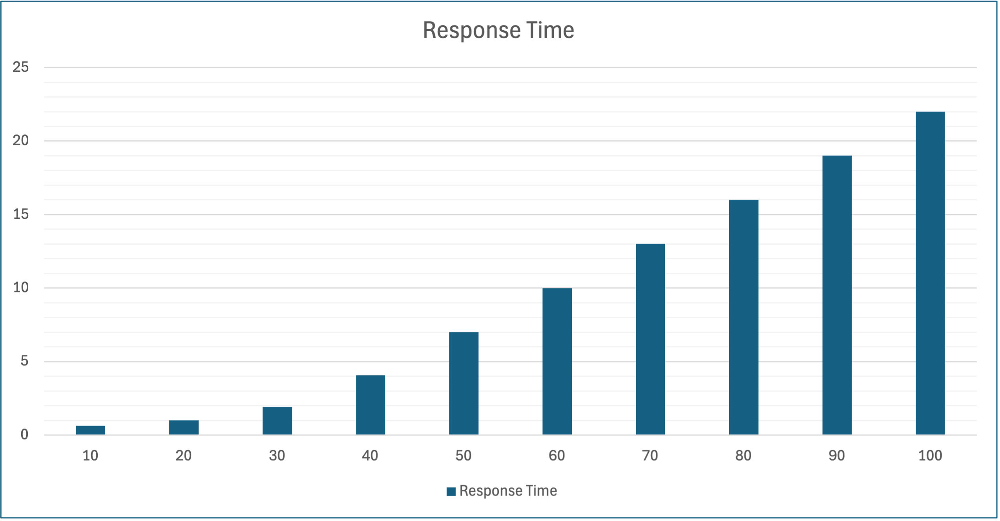
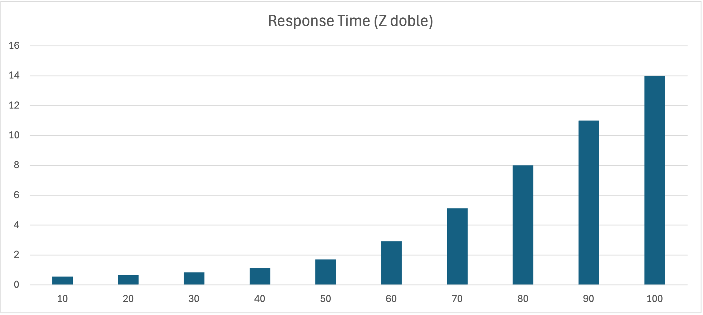
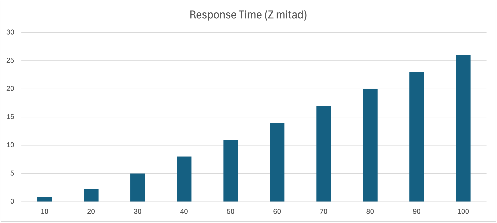

\pagebreak

# Apartado A

**Viendo el fichero de resultados**

```
  SIMULOG   ***  QNAP2  ***  ( 28-02-1999  ) V 9.4   
  (C)  COPYRIGHT BY CII HONEYWELL BULL AND INRIA, 1986
 
 
      1 /DECLARE/ QUEUE CPU,DISC(2),TERMINAL;
      2           REAL PROB1(2)=(7.,1.);
      3           REAL TTR1,TOTAL,WORK;
      4           INTEGER I,N1;
      5 /STATION/ NAME=CPU;
      6 &         SCHED=PS;
      7           SERVICE=EXP(0.005);
      8           TRANSIT=DISC,PROB1,TERMINAL,1;
      9 /STATION/ NAME=DISC;
     10           TRANSIT=CPU;
     11 /STATION/ NAME=DISC(1);
     12           SERVICE=EXP(0.02);
     13 /STATION/ NAME=DISC(2);
     14           SERVICE=EXP(0.3);
     15 /STATION/ NAME=TERMINAL;
     16           TYPE=INFINITE;
     17           INIT=N1;
     18           SERVICE=EXP(8.);
     19           TRANSIT=CPU;
     20 /CONTROL/ CLASS=ALL QUEUE;
     21 /EXEC/    FOR N1:=20 STEP 10 UNTIL 20 DO
     22           BEGIN
     23             PRINT;
     24             PRINT("NUMERO DE USUARIOS=",N1);
     25             SOLVE;
     26           END;
 
1
 NUMERO DE USUARIOS=       20 
 - MEAN VALUE ANALYSIS ("MVA") -
 *******************************************************************
 *   NAME   *  SERVICE * BUSY PCT *  CUST NB * RESPONSE *  THRUPUT *
 *******************************************************************
 *          *          *          *          *          *          *
 *CPU       *0.5000E-02*0.1001    *0.1106    *0.5526E-02* 20.02    *
 *          *          *          *          *          *          *
 *DISC   1  *0.2000E-01*0.3114    *0.4397    *0.2824E-01* 15.57    *
 *          *          *          *          *          *          *
 *DISC   2  *0.3000    *0.6672    * 1.657    *0.7449    * 2.224    *
 *          *          *          *          *          *          *
 *TERMINAL  * 8.000    *0.0000E+00* 17.79    * 8.000    * 2.224    *
 *          *          *          *          *          *          *
 *******************************************************************
              MEMORY USED:       7088 WORDS OF 4 BYTES
               (  0.14  % OF TOTAL MEMORY)
     27 /END/
```

**¿qué dispositivo tiene la utilización mayor?, ¿por qué?**

Por la ley la utilización podemos calcular la utilización de la siguiente forma:

$$
U_i = \frac{B_i}{T} = \frac{C_i}{T}\frac{B_i}{C_i} = X_i S_i
$$

| Nombre   | Servicio ($S_i$) | Productividad ($X_i$) | Utilización ($U_i$) |
|----------|------------------|-----------------------|---------------------|
| CPU      | 0.005            | 20.02                 | 0.1001              |
| DISC 1   | 0.02             | 15.57                 | 0.3114              |
| DISC 2   | 0.3              | 2.224                 | 0.6672              |
| TERMINAL | 8.0              | 2.224                 | 17.792              |

El dispositivo con la utilización mayor es el TERMINAL debido a que tiene un tiempo de servicio muy alto comparado con el resto de dispositivos.

**¿cuál es la productividad del sistema?**

La productividad del sistema se puede calcular utilizando la ley del flujo forzado: $X_i = X_0 V_i \implies X_0 = \frac{X_i}{V_i}$. Por ejemplo, reemplaznado la expresión con los valores de la CPU: $X_0 = \frac{20.02}{9} = 2.224$ que es coherente con los valores de productividad de la tabla ya que la productividad total del sistema es la productividad mínima de todos los dispositivos.

**¿cuántos usuarios están reflexionando?**

Por la ley del tiempo de respuesta interactiva:

$$
R = \frac{N}{X} - Z \implies Z = \frac{N}{X} - R
$$

En este caso $R = 0.005526 + 0.02824 + 0.7449 = 0.7786$ del cual podemos obtener el tiempo de reflexión:

$$
Z = \frac{20}{2.224} - 0.7786 = 8.2142
$$

a partir del cual podemos obtener el número de usuarios reflexionando:

$$
N_Z = XZ = 2.224 \cdot 8.2142 = 18.2683
$$

\pagebreak

# Apartado B

**Resuelve el resto del problema 4.18 pero con la herramienta QNAP, es decir:**

1. **Programad el cálculo de las demandas de los tres dispositivos y su impresión.**

Como la demanda es $D_i = S_i V_i$ podemos utilizar la función `MSERVICE` para obtener el tiempo medio de servicio para cada dispositivo y la razón de visita es una variable que definimos nosotros. Implementado en las líneas 30-39 del modelo.

2. **Programad el cálculo del tiempo de respuesta del sistema (R) y el tiempo TOTAL (R+Z), así como el número de usuarios trabajando (imprimid todos los valores que no muestra el fichero de resultados por defecto).**

El tiempo de reflexión lo definimos nosotros pero también lo podemos obtener con la función `MSERVICE(TERMINAL)` (línea 41). El tiempo de respuesta se puede calcular con la ley del tiempo de respuesta interactiva: $R = \frac{N}{X} - Z$ (línea 42). La cantidad de usuarios que estan trabajando se puede obtener a través de la ley de Little $N_i = X_i R_i$, en este caso la productividad del sistema, $X_0$, es la productividad del terminal (que se puede obtener con `MTHRUPUT(TERMINAL)`). Implementación de todo el apartado en las líneas 41-52.

3. **Programad e imprimid las probabilidades de encaminamiento entre todas las colas del modelo del servidor central.**

La probabilidad de cada encaminamiento es la razón de visita asignada al dispositivo de destino dividido por el total de razones de visitas (es decir, es un ratio del total de las razones de visitas). En este modelo, como todos los dispositivos envian de forma directa o indirecta los usuarios a la CPU, la razón de visita de la CPU es el total del resto de visitas, lo que implica que todos los encaminamientos hacia la CPU tienen una probabilidad del 100%. Implementado en líneas 54-62.

```
  SIMULOG   ***  QNAP2  ***  ( 28-02-1999  ) V 9.4   
  (C)  COPYRIGHT BY CII HONEYWELL BULL AND INRIA, 1986
 
 
      1 /DECLARE/ QUEUE CPU,DISC(2),TERMINAL;
      2           REAL V_DISC(2)=(7.,1.),V_TERM=1.;
      3           REAL V_CPU=V_DISC(1) + V_DISC(2) + V_TERM;
      4           REAL V_TOTAL=V_DISC(1) + V_DISC(2) + V_TERM;
      5           REAL D_CPU, D_DISC1, D_DISC2;
      6           REAL T_R,T_T,T_Z,WORK;
      7           INTEGER I,N1;
      8 /STATION/ NAME=CPU;
      9 &         SCHED=PS;
     10           SERVICE=EXP(0.005);
     11           TRANSIT=DISC,V_DISC,TERMINAL,V_TERM;
     12 /STATION/ NAME=DISC;
     13           TRANSIT=CPU;
     14 /STATION/ NAME=DISC(1);
     15           SERVICE=EXP(0.02);
     16 /STATION/ NAME=DISC(2);
     17           SERVICE=EXP(0.3);
     18 /STATION/ NAME=TERMINAL;
     19           TYPE=INFINITE;
     20           INIT=N1;
     21           SERVICE=EXP(8.);
     22           TRANSIT=CPU;
     23 /CONTROL/ CLASS=ALL QUEUE;
     24 /EXEC/    FOR N1:=20 STEP 10 UNTIL 20 DO
     25           BEGIN
     26             PRINT;
     27             PRINT("NUMERO DE USUARIOS=",N1);
     28             SOLVE;
     29  
     30             D_CPU := MSERVICE(CPU) * V_CPU;
     31             D_DISC1 := MSERVICE(DISC(1)) * V_DISC(1);
     32             D_DISC2 := MSERVICE(DISC(2)) * V_DISC(2);
     33  
     34             PRINT("");
     35             PRINT("---------- DEMANDAS DE LOS DISPOSITIVOS ----------");
     36             PRINT("Demanda CPU   = ", D_CPU);
     37             PRINT("Demanda DISC1 = ", D_DISC1);
     38             PRINT("Demanda DISC2 = ", D_DISC2);
     39             PRINT("---------------------------------------------------")
;
     40  
     41             T_Z := MSERVICE(TERMINAL);
     42             T_R := N1 / MTHRUPUT(TERMINAL) - T_Z;
     43             T_T := T_R + T_Z;
     44             WORK := MTHRUPUT(TERMINAL) * T_Z;
     45  
     46             PRINT("");
     47             PRINT("-------------- TIEMPOS DE RESPUESTA ---------------")
;
     48             PRINT("Tiempo de respuesta del sistema (R) = ", T_R);
     49             PRINT("Tiempo de reflexion (Z)             = ", T_Z);
     50             PRINT("Tiempo TOTAL (R+Z)                  = ", T_T);
     51             PRINT("Número de usuarios trabajando       = ", WORK);
     52             PRINT("---------------------------------------------------")
;
     53  
     54             PRINT("");
     55             PRINT("---------- PROBABILIDADES DE ENCAMINAMIENTO ---------
-");
     56             PRINT("Probabilidad CPU -> DISC1    = ", V_DISC(1) / V_TOTAL
);
     57             PRINT("Probabilidad CPU -> DISC2    = ", V_DISC(2) / V_TOTAL
);
     58             PRINT("Probabilidad CPU -> TERMINAL = ", V_TERM / V_TOTAL);
     59             PRINT("Probabilidad DISC1 -> CPU    = ", 1.0);
     60             PRINT("Probabilidad DISC2 -> CPU    = ", 1.0);
     61             PRINT("Probabilidad TERMINAL -> CPU = ", 1.0);
     62             PRINT("----------------------------------------------------"
);
     63           END;
 
1
 NUMERO DE USUARIOS=       20 
 - MEAN VALUE ANALYSIS ("MVA") -
 *******************************************************************
 *   NAME   *  SERVICE * BUSY PCT *  CUST NB * RESPONSE *  THRUPUT *
 *******************************************************************
 *          *          *          *          *          *          *
 *CPU       *0.5000E-02*0.1001    *0.1106    *0.5526E-02* 20.02    *
 *          *          *          *          *          *          *
 *DISC   1  *0.2000E-01*0.3114    *0.4397    *0.2824E-01* 15.57    *
 *          *          *          *          *          *          *
 *DISC   2  *0.3000    *0.6672    * 1.657    *0.7449    * 2.224    *
 *          *          *          *          *          *          *
 *TERMINAL  * 8.000    *0.0000E+00* 17.79    * 8.000    * 2.224    *
 *          *          *          *          *          *          *
 *******************************************************************
              MEMORY USED:       7748 WORDS OF 4 BYTES
               (  0.15  % OF TOTAL MEMORY)
 
 ---------- DEMANDAS DE LOS DISPOSITIVOS ----------
 Demanda CPU   =   0.4500E-01
 Demanda DISC1 =   0.1400    
 Demanda DISC2 =   0.3000    
 ---------------------------------------------------
 
 -------------- TIEMPOS DE RESPUESTA ---------------
 Tiempo de respuesta del sistema (R) =   0.9923    
 Tiempo de reflexion (Z)             =    8.000    
 Tiempo TOTAL (R+Z)                  =    8.992    
 Número de usuarios trabajando       =    17.79    
 ---------------------------------------------------
 
 ---------- PROBABILIDADES DE ENCAMINAMIENTO ----------
 Probabilidad CPU -> DISC1    =   0.7778    
 Probabilidad CPU -> DISC2    =   0.1111    
 Probabilidad CPU -> TERMINAL =   0.1111    
 Probabilidad DISC1 -> CPU    =    1.000    
 Probabilidad DISC2 -> CPU    =    1.000    
 Probabilidad TERMINAL -> CPU =    1.000    
 ----------------------------------------------------
     64 /END/
```

\pagebreak

# Apartado C

**Cambiad la velocidad del procesador por uno el doble de rápido**

Se ha dividido el tiempo de servicio de la CPU a la mitad (línea 7 del modelo).

```
  SIMULOG   ***  QNAP2  ***  ( 28-02-1999  ) V 9.4   
  (C)  COPYRIGHT BY CII HONEYWELL BULL AND INRIA, 1986
 
 
      1 /DECLARE/ QUEUE CPU,DISC(2),TERMINAL;
      2           REAL PROB1(2)=(7.,1.);
      3           REAL TTR1,TOTAL,WORK;
      4           INTEGER I,N1;
      5 /STATION/ NAME=CPU;
      6 &         SCHED=PS;
      7           SERVICE=EXP(0.00025);
      8           TRANSIT=DISC,PROB1,TERMINAL,1;
      9 /STATION/ NAME=DISC;
     10           TRANSIT=CPU;
     11 /STATION/ NAME=DISC(1);
     12           SERVICE=EXP(0.02);
     13 /STATION/ NAME=DISC(2);
     14           SERVICE=EXP(0.3);
     15 /STATION/ NAME=TERMINAL;
     16           TYPE=INFINITE;
     17           INIT=N1;
     18           SERVICE=EXP(8.);
     19           TRANSIT=CPU;
     20 /CONTROL/ CLASS=ALL QUEUE;
     21 /EXEC/    FOR N1:=20 STEP 10 UNTIL 20 DO
     22           BEGIN
     23             PRINT;
     24             PRINT("NUMERO DE USUARIOS=",N1);
     25             SOLVE;
     26           END;
 
1
 NUMERO DE USUARIOS=       20 
 - MEAN VALUE ANALYSIS ("MVA") -
 *******************************************************************
 *   NAME   *  SERVICE * BUSY PCT *  CUST NB * RESPONSE *  THRUPUT *
 *******************************************************************
 *          *          *          *          *          *          *
 *CPU       *0.2500E-03*0.5028E-02*0.5052E-02*0.2512E-03* 20.11    *
 *          *          *          *          *          *          *
 *DISC   1  *0.2000E-01*0.3128    *0.4426    *0.2829E-01* 15.64    *
 *          *          *          *          *          *          *
 *DISC   2  *0.3000    *0.6704    * 1.675    *0.7497    * 2.235    *
 *          *          *          *          *          *          *
 *TERMINAL  * 8.000    *0.0000E+00* 17.88    * 8.000    * 2.235    *
 *          *          *          *          *          *          *
 *******************************************************************
              MEMORY USED:       7088 WORDS OF 4 BYTES
               (  0.14  % OF TOTAL MEMORY)
     27 /END/
```

**¿varían mucho los resultados? ¿Por qué?**

Como era de esperar, el tiempo de servicio y de respuesta de la CPU han disminuido a la mitad. Sin embargo, la productividad casi no varía y el resto de dispositivos permaneces prácticamente sin cambios. Esto es debido a que el resto de dispositivos no pueden ir más rápido (ya estaban cerca de su máximo de velocidada) y la CPU sigue recibiendo usuarios a la misma velocidad que antes.

\pagebreak

# Apartado D

**Volved a vuestro modelo original y ahora usad dos procesadores en vez de uno con la velocidad original.**

Se ha cambiado la estación CPU a un vector (línea 1), se han asignado probabilidades iguales entre ambas CPUs (línea 3) y se ha duplicado la estación CPU con los mismos tiempos de servicio (líneas 9-12).

```
  SIMULOG   ***  QNAP2  ***  ( 28-02-1999  ) V 9.4   
  (C)  COPYRIGHT BY CII HONEYWELL BULL AND INRIA, 1986
 
 
      1 /DECLARE/ QUEUE CPU(2),DISC(2),TERMINAL;
      2           REAL PROB_DISC(2)=(7.,1.);
 (060301)  ==>WARNING (DECLARE) : THIS IDENTIFIER IS TOO LONG
                                  (TRUNCATED) : PROB_DIS
      3           REAL PROB_CPU(2)=(0.5,0.5);
      4           REAL TTR1,TOTAL,WORK;
      5           INTEGER I,N1;
      6 /STATION/ NAME=CPU;
      7 &         SCHED=PS;
      8           TRANSIT=DISC,PROB_DISC,TERMINAL,1;
      9 /STATION/ NAME=CPU(1);
     10           SERVICE=EXP(0.005);
     11 /STATION/ NAME=CPU(2);
     12           SERVICE=EXP(0.005);
     13 /STATION/ NAME=DISC;
     14           TRANSIT=CPU,PROB_CPU;
     15 /STATION/ NAME=DISC(1);
     16           SERVICE=EXP(0.02);
     17 /STATION/ NAME=DISC(2);
     18           SERVICE=EXP(0.3);
     19 /STATION/ NAME=TERMINAL;
     20           TYPE=INFINITE;
     21           INIT=N1;
     22           SERVICE=EXP(8.);
     23           TRANSIT=CPU,PROB_CPU;
     24 /CONTROL/ CLASS=ALL QUEUE;
     25 /EXEC/    FOR N1:=20 STEP 10 UNTIL 20 DO
     26           BEGIN
     27             PRINT;
     28             PRINT("NUMERO DE USUARIOS=",N1);
     29             SOLVE;
     30           END;
 
1
 NUMERO DE USUARIOS=       20 
 - MEAN VALUE ANALYSIS ("MVA") -
 *******************************************************************
 *   NAME   *  SERVICE * BUSY PCT *  CUST NB * RESPONSE *  THRUPUT *
 *******************************************************************
 *          *          *          *          *          *          *
 *CPU    1  *0.5000E-02*0.5006E-01*0.5256E-01*0.5250E-02* 10.01    *
 *          *          *          *          *          *          *
 *CPU    2  *0.5000E-02*0.5006E-01*0.5256E-01*0.5250E-02* 10.01    *
 *          *          *          *          *          *          *
 *DISC   1  *0.2000E-01*0.3115    *0.4398    *0.2824E-01* 15.57    *
 *          *          *          *          *          *          *
 *DISC   2  *0.3000    *0.6674    * 1.658    *0.7452    * 2.225    *
 *          *          *          *          *          *          *
 *TERMINAL  * 8.000    *0.0000E+00* 17.80    * 8.000    * 2.225    *
 *          *          *          *          *          *          *
 *******************************************************************
              MEMORY USED:       7442 WORDS OF 4 BYTES
               (  0.15  % OF TOTAL MEMORY)
     31 /END/
```

**¿qué ha pasado con el rendimiento ahora? ¿Qué diferencias hay con el modelo del apartado anterior?**

Los tiempos de servicio y de respuesta permanecen iguales (ahora estan duplicados en dos CPUs) pero la productividad se ha dividido en partes iguales entre las dos CPUs (porque hemos asignado la misma razón de visita a cada CPU). La productividad del sistema no varía porque el resto de dispositivos siguen recibiendo y procesando usuarios al mismo ritmo de tiempo que antes.

\pagebreak

# Apartado E

**Volved a vuestro modelo original y ahora equilibrad la E/S.**

Para equilibrar la E/S se ha igualado la demanda de ambos discos. La demanda de cada disco se puede calcular multiplicando su razón de visita por su tiempo de servicio:

\begin{align*}
D_{D1} &= V_{D1} \cdot S_{D1} = 7 \cdot 0.02 = 0.14 \\
D_{D2} &= V_{D2} \cdot S_{D2} = 1 \cdot 0.3 = 0.3
\end{align*}

Como no podemos cambiar el tiempo de servicio porque sería cambiar el disco por uno completamente diferente, sólo podemos cambiar la razón de visita. Además, queremos mantener el total de visitas entre los dos discos para no modificar la proporción de visitas de E/S con el resto del sistema. Con estas dos condiciones tenemos el siguiente sistema de ecuaciones:

$$
\begin{cases}
V_{D1} \cdot 0.02 - V_{D2} \cdot 0.3 &= 0 \\
V_{D1} + V_{D2} &= 8
\end{cases}
$$

Resolviendo este sistema de ecuaciones obtenemos $V_{D1} = 7.5$ y $D_{D2} = 0.5$. Se han asignado estas nuevas razones de visitas a los discos (línea 2).

```
  SIMULOG   ***  QNAP2  ***  ( 28-02-1999  ) V 9.4   
  (C)  COPYRIGHT BY CII HONEYWELL BULL AND INRIA, 1986
 
 
      1 /DECLARE/ QUEUE CPU,DISC(2),TERMINAL;
      2           REAL PROB1(2)=(7.5,0.5);
      3           REAL TTR1,TOTAL,WORK;
      4           INTEGER I,N1;
      5 /STATION/ NAME=CPU;
      6 &         SCHED=PS;
      7           SERVICE=EXP(0.005);
      8           TRANSIT=DISC,PROB1,TERMINAL,1;
      9 /STATION/ NAME=DISC;
     10           TRANSIT=CPU;
     11 /STATION/ NAME=DISC(1);
     12           SERVICE=EXP(0.02);
     13 /STATION/ NAME=DISC(2);
     14           SERVICE=EXP(0.3);
     15 /STATION/ NAME=TERMINAL;
     16           TYPE=INFINITE;
     17           INIT=N1;
     18           SERVICE=EXP(8.);
     19           TRANSIT=CPU;
     20 /CONTROL/ CLASS=ALL QUEUE;
     21 /EXEC/    FOR N1:=20 STEP 10 UNTIL 20 DO
     22           BEGIN
     23             PRINT;
     24             PRINT("NUMERO DE USUARIOS=",N1);
     25             SOLVE;
     26           END;
 
1
 NUMERO DE USUARIOS=       20 
 - MEAN VALUE ANALYSIS ("MVA") -
 *******************************************************************
 *   NAME   *  SERVICE * BUSY PCT *  CUST NB * RESPONSE *  THRUPUT *
 *******************************************************************
 *          *          *          *          *          *          *
 *CPU       *0.5000E-02*0.1059    *0.1177    *0.5557E-02* 21.19    *
 *          *          *          *          *          *          *
 *DISC   1  *0.2000E-01*0.3531    *0.5252    *0.2975E-01* 17.65    *
 *          *          *          *          *          *          *
 *DISC   2  *0.3000    *0.3531    *0.5252    *0.4463    * 1.177    *
 *          *          *          *          *          *          *
 *TERMINAL  * 8.000    *0.0000E+00* 18.83    * 8.000    * 2.354    *
 *          *          *          *          *          *          *
 *******************************************************************
              MEMORY USED:       7088 WORDS OF 4 BYTES
               (  0.14  % OF TOTAL MEMORY)
     27 /END/
```

**¿Qué ha pasado con el rendimiento ahora?**

La productividad del disco 1 (el más rápido) ha incrementado porque también hemos incrementado su razón de visita y la del disco 2 (el más lento) ha disminuido porque hemos decrementado su razón de visita. Como este último era un cuello de botella en el modelo anterior y ahora ya no lo es, la productividad de la CPU también a subido (recibe menos usuarios del disco 2 pero recibe muchos más del disco 1) lo que significa que ahora se esta aprovechando más la CPU.

\pagebreak

# Apartado F

**Volved a vuestro modelo original y eliminad el disco que solo tiene una visita y pasad esa visita al otro disco.**

Se ha eliminado el disco modificando las variables `DISC` y `PROB1` de vectores a escalares. Como `PROB1` tenia los valores 7 y 1 se le ha asignado la suma de los dos (línea 2).

```
  SIMULOG   ***  QNAP2  ***  ( 28-02-1999  ) V 9.4   
  (C)  COPYRIGHT BY CII HONEYWELL BULL AND INRIA, 1986
 
 
      1 /DECLARE/ QUEUE CPU,DISC,TERMINAL;
      2           REAL PROB1=8.;
      3           REAL TTR1,TOTAL,WORK;
      4           INTEGER I,N1;
      5 /STATION/ NAME=CPU;
      6 &         SCHED=PS;
      7           SERVICE=EXP(0.005);
      8           TRANSIT=DISC,PROB1,TERMINAL,1;
      9 /STATION/ NAME=DISC;
     10           TRANSIT=CPU;
     11           SERVICE=EXP(0.02);
     12 /STATION/ NAME=TERMINAL;
     13           TYPE=INFINITE;
     14           INIT=N1;
     15           SERVICE=EXP(8.);
     16           TRANSIT=CPU;
     17 /CONTROL/ CLASS=ALL QUEUE;
     18 /EXEC/    FOR N1:=20 STEP 10 UNTIL 20 DO
     19           BEGIN
     20             PRINT;
     21             PRINT("NUMERO DE USUARIOS=",N1);
     22             SOLVE;
     23           END;
 
1
 NUMERO DE USUARIOS=       20 
 - MEAN VALUE ANALYSIS ("MVA") -
 *******************************************************************
 *   NAME   *  SERVICE * BUSY PCT *  CUST NB * RESPONSE *  THRUPUT *
 *******************************************************************
 *          *          *          *          *          *          *
 *CPU       *0.5000E-02*0.1084    *0.1208    *0.5571E-02* 21.69    *
 *          *          *          *          *          *          *
 *DISC      *0.2000E-01*0.3856    *0.5992    *0.3108E-01* 19.28    *
 *          *          *          *          *          *          *
 *TERMINAL  * 8.000    *0.0000E+00* 19.28    * 8.000    * 2.410    *
 *          *          *          *          *          *          *
 *******************************************************************
              MEMORY USED:       6784 WORDS OF 4 BYTES
               (  0.14  % OF TOTAL MEMORY)
     24 /END/
```

**¿qué variaciones ocurren en los valores anteriores? ¿Por qué?**

La productividad del disco que queda ha subido porque era el disco más rápido y aún era capaz de procesar más usuarios por unidad de tiempo. En consecuencia, la productividad de la CPU también ha subido. Además, podemos ver que el tiempo de respuesta del disco ha subido lo que significa que ahora tiene un tiempo de espera más largo (porque hay más usuarios en la cola).

**Aproximad la velocidad del único disco para que el tiempo de respuesta del sistema fuera el del modelo original.**

Probando con diferentes valores he llegado a un tiempo de servicio del 0.019 (línea 11), muy cerca del original de 0.02.

```
  SIMULOG   ***  QNAP2  ***  ( 28-02-1999  ) V 9.4   
  (C)  COPYRIGHT BY CII HONEYWELL BULL AND INRIA, 1986
 
 
      1 /DECLARE/ QUEUE CPU,DISC,TERMINAL;
      2           REAL PROB1=8.;
      3           REAL TTR1,TOTAL,WORK;
      4           INTEGER I,N1;
      5 /STATION/ NAME=CPU;
      6 &         SCHED=PS;
      7           SERVICE=EXP(0.005);
      8           TRANSIT=DISC,PROB1,TERMINAL,1;
      9 /STATION/ NAME=DISC;
     10           TRANSIT=CPU;
     11           SERVICE=EXP(0.019);
     12 /STATION/ NAME=TERMINAL;
     13           TYPE=INFINITE;
     14           INIT=N1;
     15           SERVICE=EXP(8.);
     16           TRANSIT=CPU;
     17 /CONTROL/ CLASS=ALL QUEUE;
     18 /EXEC/    FOR N1:=20 STEP 10 UNTIL 20 DO
     19           BEGIN
     20             PRINT;
     21             PRINT("NUMERO DE USUARIOS=",N1);
     22             SOLVE;
     23           END;
 
1
 NUMERO DE USUARIOS=       20 
 - MEAN VALUE ANALYSIS ("MVA") -
 *******************************************************************
 *   NAME   *  SERVICE * BUSY PCT *  CUST NB * RESPONSE *  THRUPUT *
 *******************************************************************
 *          *          *          *          *          *          *
 *CPU       *0.5000E-02*0.1087    *0.1211    *0.5572E-02* 21.74    *
 *          *          *          *          *          *          *
 *DISC      *0.1900E-01*0.3671    *0.5563    *0.2879E-01* 19.32    *
 *          *          *          *          *          *          *
 *TERMINAL  * 8.000    *0.0000E+00* 19.32    * 8.000    * 2.415    *
 *          *          *          *          *          *          *
 *******************************************************************
              MEMORY USED:       6784 WORDS OF 4 BYTES
               (  0.14  % OF TOTAL MEMORY)
     24 /END/
```

\pagebreak

# Apartado G

**Volved a vuestro modelo original y cread otro disco gemelo al original (el de 7 visitas) y pasadle 3 visitas al disco gemelo**

Se han modificado las variables vectoriales `DISC` y `PROB1` para representar 3 discos (líneas 1 y 2). En la variable `PROB`, el primer disco se le han restado 3 visitas y al tercero se le han asignado 3, de forma que el total de visitas queda igual. El tiempo de servicio del disco 3 es idéntico al del disco 1 (líneas 15 y 16).

```
  SIMULOG   ***  QNAP2  ***  ( 28-02-1999  ) V 9.4   
  (C)  COPYRIGHT BY CII HONEYWELL BULL AND INRIA, 1986
 
 
      1 /DECLARE/ QUEUE CPU,DISC(3),TERMINAL;
      2           REAL PROB1(3)=(4.,1.,3.);
      3           REAL TTR1,TOTAL,WORK;
      4           INTEGER I,N1;
      5 /STATION/ NAME=CPU;
      6 &         SCHED=PS;
      7           SERVICE=EXP(0.005);
      8           TRANSIT=DISC,PROB1,TERMINAL,1;
      9 /STATION/ NAME=DISC;
     10           TRANSIT=CPU;
     11 /STATION/ NAME=DISC(1);
     12           SERVICE=EXP(0.02);
     13 /STATION/ NAME=DISC(2);
     14           SERVICE=EXP(0.3);
     15 /STATION/ NAME=DISC(3);
     16           SERVICE=EXP(0.02);
     17 /STATION/ NAME=TERMINAL;
     18           TYPE=INFINITE;
     19           INIT=N1;
     20           SERVICE=EXP(8.);
     21           TRANSIT=CPU;
     22 /CONTROL/ CLASS=ALL QUEUE;
     23 /EXEC/    FOR N1:=20 STEP 10 UNTIL 20 DO
     24           BEGIN
     25             PRINT;
     26             PRINT("NUMERO DE USUARIOS=",N1);
     27             SOLVE;
     28           END;
 
1
 NUMERO DE USUARIOS=       20 
 - MEAN VALUE ANALYSIS ("MVA") -
 *******************************************************************
 *   NAME   *  SERVICE * BUSY PCT *  CUST NB * RESPONSE *  THRUPUT *
 *******************************************************************
 *          *          *          *          *          *          *
 *CPU       *0.5000E-02*0.1004    *0.1110    *0.5528E-02* 20.08    *
 *          *          *          *          *          *          *
 *DISC   1  *0.2000E-01*0.1785    *0.2148    *0.2406E-01* 8.926    *
 *          *          *          *          *          *          *
 *DISC   2  *0.3000    *0.6695    * 1.669    *0.7478    * 2.232    *
 *          *          *          *          *          *          *
 *DISC   3  *0.2000E-01*0.1339    *0.1534    *0.2291E-01* 6.695    *
 *          *          *          *          *          *          *
 *TERMINAL  * 8.000    *0.0000E+00* 17.85    * 8.000    * 2.232    *
 *          *          *          *          *          *          *
 *******************************************************************
              MEMORY USED:       7398 WORDS OF 4 BYTES
               (  0.15  % OF TOTAL MEMORY)
     29 /END/
```

**¿qué variaciones se observan en los cálculos, con respecto a tener dos discos del modelo original?**

El tiempo de respuesta del disco 1 ha bajado ligeramente, el del disco 3 és un poco más bajo que el del 1 porque tiene una razón de visita menor, que implica que va a recibir menos usuarios por unidad tiempo y tener un tiempo de cola menor.

La productividad de la CPU y del sistema no varía mucho porque la cantidad de usuarios que recibe la CPU por unidad de tiempo es el mismo. Los únicos dispositivos a los cuales se les ha "aligerado" la carga de trabajo es a los dos discos idénticos.

\pagebreak

# Apartado H

**Volved a vuestro modelo original e iterad el modelo desde 10 a 100 usuarios con saltos de 10 y construid una tabla .xls o similar y su gráfica con histogramas, en la que se vea la variación del tiempo de respuesta (R) con el número de usuarios incremental.**

Para calcular el tiempo de respuesta he utilizado la ley del tiempo de respuesta interactiva: $R = \frac{N}{X} - Z$ (línea 26).

```
  SIMULOG   ***  QNAP2  ***  ( 28-02-1999  ) V 9.4   
  (C)  COPYRIGHT BY CII HONEYWELL BULL AND INRIA, 1986
 
 
      1 /DECLARE/ QUEUE CPU,DISC(2),TERMINAL;
      2           REAL PROB1(2)=(7.,1.);
      3           REAL TTR1,TOTAL,WORK;
      4           INTEGER I,N1;
      5 /STATION/ NAME=CPU;
      6 &         SCHED=PS;
      7           SERVICE=EXP(0.005);
      8           TRANSIT=DISC,PROB1,TERMINAL,1;
      9 /STATION/ NAME=DISC;
     10           TRANSIT=CPU;
     11 /STATION/ NAME=DISC(1);
     12           SERVICE=EXP(0.02);
     13 /STATION/ NAME=DISC(2);
     14           SERVICE=EXP(0.3);
     15 /STATION/ NAME=TERMINAL;
     16           TYPE=INFINITE;
     17           INIT=N1;
     18           SERVICE=EXP(8.);
     19           TRANSIT=CPU;
     20 /CONTROL/ CLASS=ALL QUEUE;
     21 /EXEC/    FOR N1:=10 STEP 10 UNTIL 100 DO
     22           BEGIN
     23             PRINT;
     24             PRINT("NUMERO DE USUARIOS=",N1);
     25             SOLVE;
     26             PRINT("R = ", N1 / MTHRUPUT(TERMINAL) - MSERVICE(TERMINAL));
     27           END;
```



Podemos ver que para los 3 primeros intervalos de usuarios el tiempo de respuesta sube muy poco a poco, pero a partir de 40 usuarios el tiempo de respuesta se dispara y va creciendo mucho más rápido a medida que los usuarios augmentan. Esto indica que el sistema esta al límite y hay muchos usuarios que tienen que esperar en colas de varios dispositivos.

\pagebreak

# Apartado I

**Sobre el modelo del apartado h, cambiad el tiempo de reflexión al doble y a la mitad. Representad en la tabla anterior los nuevos tiempos de respuesta (R) ¿Qué ha ocurrido? Representa con 2 gráficos de histogramas comparativos.**

He caclulado el tiempo de respuesta de la misma forma que el apartado anterior y he cambiado el tiempo de servicio del terminal (línea 18) a 4 para la mitad y 16 para el doble.

```
  SIMULOG   ***  QNAP2  ***  ( 28-02-1999  ) V 9.4   
  (C)  COPYRIGHT BY CII HONEYWELL BULL AND INRIA, 1986
 
 
      1 /DECLARE/ QUEUE CPU,DISC(2),TERMINAL;
      2           REAL PROB1(2)=(7.,1.);
      3           REAL TTR1,TOTAL,WORK;
      4           INTEGER I,N1;
      5 /STATION/ NAME=CPU;
      6 &         SCHED=PS;
      7           SERVICE=EXP(0.005);
      8           TRANSIT=DISC,PROB1,TERMINAL,1;
      9 /STATION/ NAME=DISC;
     10           TRANSIT=CPU;
     11 /STATION/ NAME=DISC(1);
     12           SERVICE=EXP(0.02);
     13 /STATION/ NAME=DISC(2);
     14           SERVICE=EXP(0.3);
     15 /STATION/ NAME=TERMINAL;
     16           TYPE=INFINITE;
     17           INIT=N1;
     18           SERVICE=EXP(4.);
     19           TRANSIT=CPU;
     20 /CONTROL/ CLASS=ALL QUEUE;
     21 /EXEC/    FOR N1:=10 STEP 10 UNTIL 100 DO
     22           BEGIN
     23             PRINT;
     24             PRINT("NUMERO DE USUARIOS=",N1);
     25             SOLVE;
     26             PRINT("R = ", N1 / MTHRUPUT(TERMINAL) - MSERVICE(TERMINAL));
     27           END;
```





Incrementar el teimpo de reflexión provoca que haya menos usuarios trabajando y que entren en el sistema de forma mas espaciada. Esto significa que los dispositivos reciben menos usuarios por unidad de tiempo y requieren de muchos más usuarios en el sistema para llegar a su límite y que su cola incremente, que es consecuencia incrementa el tiempo de respuesta.

Si comparamos las dos graficas podemos ver en el caso de doble de tiempo de reflexión el sistema puede tolerar muchos más usuarios (tarda más en llegar a su límite) y en el caso de la mitad de tiempo de reflexión el sistema puede tolerar muchos menos usuarios (llega antes a su límite).
