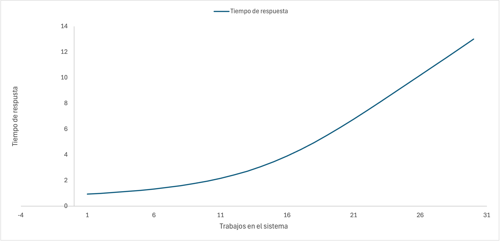
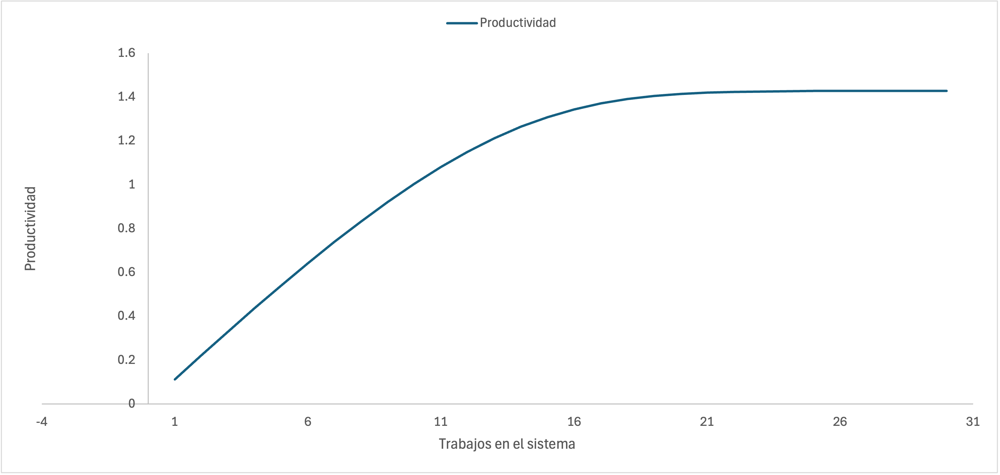
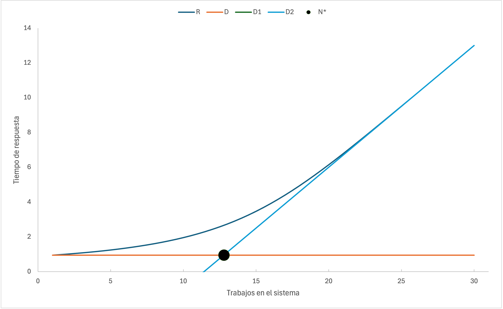
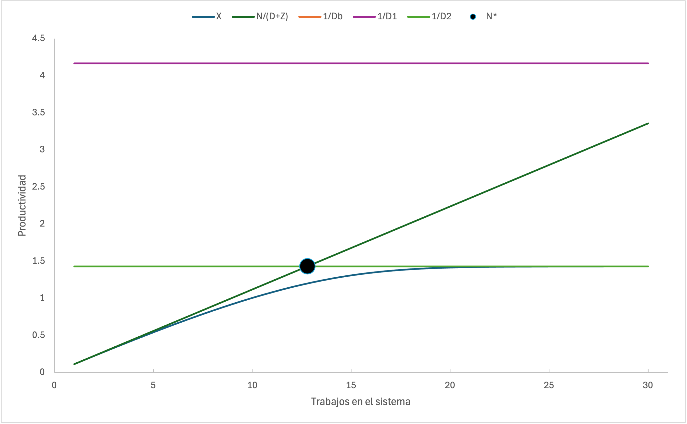
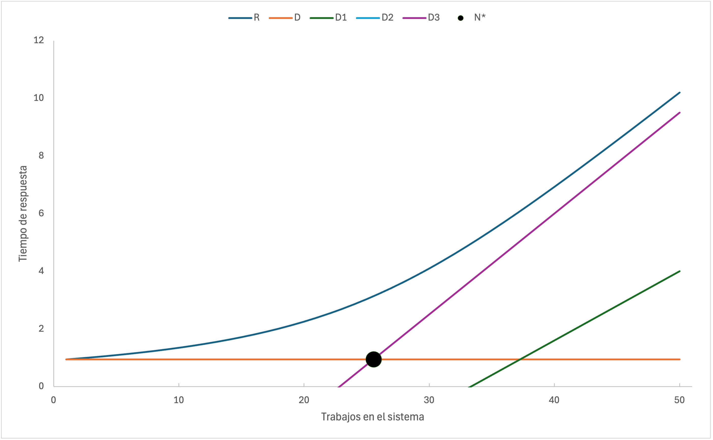
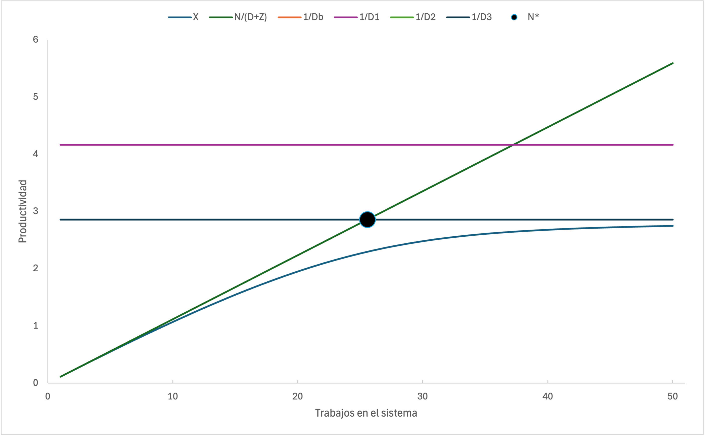

\pagebreak

# Modelo base

La productividad del sistema es la productividad del terminal, por lo tanto: `X := MTHRUPUT(TERMINAL)` (línea 24).

El tiempo de respuesta del sistema se puede calcular a partir de la ley del tiempo de respuesta interactiva: $R = \frac{N}{X} - Z$. Como $X$ ya la hemos calculado, $N$ es el numero total de usuarios y $Z$ el tiempo de servicio del terminal: `R := N / X - MSERVICE(TERMINAL)` (línea 27). El tiempo de respuesta de la CPU, $R1$, y el tiempo de respuesta del disco, $R2$, se pueden obtener con la función `MRESPONS()` (líneas 25-26).

La cantidad de usuarios en la CPU, $N1$, y la cantidad de usuarios del disco, $N2$, se pueden calcular a partir de la siguiente expresión: $N_i = X_i \dot R_i$ (líneas 30-31).

Ejecutando el modelo se han obtenido los siguientes resultados:

| N        | R1      | R2      | R       | X       | N1      | N2      |
|----------|---------|---------|---------|---------|---------|---------|
| 1        | 0.0300  | 0.1000  | 0.9400  | 0.1119  | 0.0268  | 0.0783  |
| 2        | 0.0308  | 0.1078  | 1.0010  | 0.2222  | 0.0547  | 0.1677  |
| 3        | 0.0316  | 0.1168  | 1.0710  | 0.3307  | 0.0837  | 0.2703  |
| 4        | 0.0325  | 0.1270  | 1.1490  | 0.4372  | 0.1137  | 0.3888  |
| 5        | 0.0334  | 0.1389  | 1.2390  | 0.5412  | 0.1446  | 0.5261  |
| 6        | 0.0343  | 0.1526  | 1.3430  | 0.6422  | 0.1764  | 0.6860  |
| 7        | 0.0352  | 0.1686  | 1.4630  | 0.7398  | 0.2089  | 0.8731  |
| 8        | 0.0362  | 0.1873  | 1.6010  | 0.8332  | 0.2417  | 1.0920  |
| 9        | 0.0372  | 0.2092  | 1.7630  | 0.9219  | 0.2747  | 1.3500  |
| 10       | 0.0382  | 0.2350  | 1.9510  | 1.0050  | 0.3074  | 1.6530  |

```
      1 /DECLARE/ QUEUE CPU,DISC,TERMINAL;
      2           REAL Z=8.;
      3           REAL V_CPU=8.,V_DISC=7.;
      4           REAL X,X1,X2,R,R1,R2,N1,N2;
      5           INTEGER N;
      6 /STATION/ NAME=CPU;
      7 &         SCHED=PS;
      8           SERVICE=EXP(0.03);
      9           TRANSIT=DISC,V_DISC,TERMINAL,1;
     10 /STATION/ NAME=DISC;
     11           TRANSIT=CPU;
     12           SERVICE=EXP(0.1);
     13 /STATION/ NAME=TERMINAL;
     14           TYPE=INFINITE;
     15           INIT=N;
     16           SERVICE=EXP(Z);
     17           TRANSIT=CPU;
     18 /CONTROL/ CLASS=ALL QUEUE;
     19 /EXEC/    FOR N:=1 STEP 1 UNTIL 10 DO
     20           BEGIN
     21             PRINT;
     22             PRINT("NUMERO DE USUARIOS=",N);
     23             SOLVE;
     24  
     25             X := MTHRUPUT(TERMINAL);
     26             X1 := MTHRUPUT(CPU);
     27             X2 := MTHRUPUT(DISC);
     28             R := N / X - Z;
     29             R1 := MRESPONS(CPU);
     30             R2 := MRESPONS(DISC);
     31             N1 := X1 * R1;
     32             N2 := X2 * R2;
     33  
     34             PRINT("R1 = ", R1);
     35             PRINT("R2 = ", R2);
     36             PRINT("X = ", X);
     37             PRINT("R  = ", R);
     38             PRINT("N1 = ", N1);
     39             PRINT("N2 = ", N2);
     40           END;
 
1
 NUMERO DE USUARIOS=        1 
 - MEAN VALUE ANALYSIS ("MVA") -
 *******************************************************************
 *   NAME   *  SERVICE * BUSY PCT *  CUST NB * RESPONSE *  THRUPUT *
 *******************************************************************
 *          *          *          *          *          *          *
 *CPU       *0.3000E-01*0.2685E-01*0.2685E-01*0.3000E-01*0.8949    *
 *          *          *          *          *          *          *
 *DISC      *0.1000    *0.7830E-01*0.7830E-01*0.1000    *0.7830    *
 *          *          *          *          *          *          *
 *TERMINAL  * 8.000    *0.0000E+00*0.8949    * 8.000    *0.1119    *
 *          *          *          *          *          *          *
 *******************************************************************
              MEMORY USED:       6992 WORDS OF 4 BYTES
               (  0.14  % OF TOTAL MEMORY)
 R1 =   0.3000E-01
 R2 =   0.1000    
 X =   0.1119    
 R  =   0.9400    
 N1 =   0.2685E-01
 N2 =   0.7830E-01
 
1
 NUMERO DE USUARIOS=        2 
 - MEAN VALUE ANALYSIS ("MVA") -
 *******************************************************************
 *   NAME   *  SERVICE * BUSY PCT *  CUST NB * RESPONSE *  THRUPUT *
 *******************************************************************
 *          *          *          *          *          *          *
 *CPU       *0.3000E-01*0.5333E-01*0.5476E-01*0.3081E-01* 1.778    *
 *          *          *          *          *          *          *
 *DISC      *0.1000    *0.1555    *0.1677    *0.1078    * 1.555    *
 *          *          *          *          *          *          *
 *TERMINAL  * 8.000    *0.0000E+00* 1.778    * 8.000    *0.2222    *
 *          *          *          *          *          *          *
 *******************************************************************
              MEMORY USED:       7018 WORDS OF 4 BYTES
               (  0.14  % OF TOTAL MEMORY)
 R1 =   0.3081E-01
 R2 =   0.1078    
 X =   0.2222    
 R  =    1.001    
 N1 =   0.5476E-01
 N2 =   0.1677    
 
1
 NUMERO DE USUARIOS=        3 
 - MEAN VALUE ANALYSIS ("MVA") -
 *******************************************************************
 *   NAME   *  SERVICE * BUSY PCT *  CUST NB * RESPONSE *  THRUPUT *
 *******************************************************************
 *          *          *          *          *          *          *
 *CPU       *0.3000E-01*0.7938E-01*0.8372E-01*0.3164E-01* 2.646    *
 *          *          *          *          *          *          *
 *DISC      *0.1000    *0.2315    *0.2703    *0.1168    * 2.315    *
 *          *          *          *          *          *          *
 *TERMINAL  * 8.000    *0.0000E+00* 2.646    * 8.000    *0.3307    *
 *          *          *          *          *          *          *
 *******************************************************************
              MEMORY USED:       7044 WORDS OF 4 BYTES
               (  0.14  % OF TOTAL MEMORY)
 R1 =   0.3164E-01
 R2 =   0.1168    
 X =   0.3307    
 R  =    1.071    
 N1 =   0.8372E-01
 N2 =   0.2703    
 
1
 NUMERO DE USUARIOS=        4 
 - MEAN VALUE ANALYSIS ("MVA") -
 *******************************************************************
 *   NAME   *  SERVICE * BUSY PCT *  CUST NB * RESPONSE *  THRUPUT *
 *******************************************************************
 *          *          *          *          *          *          *
 *CPU       *0.3000E-01*0.1049    *0.1137    *0.3251E-01* 3.498    *
 *          *          *          *          *          *          *
 *DISC      *0.1000    *0.3060    *0.3888    *0.1270    * 3.060    *
 *          *          *          *          *          *          *
 *TERMINAL  * 8.000    *0.0000E+00* 3.498    * 8.000    *0.4372    *
 *          *          *          *          *          *          *
 *******************************************************************
              MEMORY USED:       7070 WORDS OF 4 BYTES
               (  0.14  % OF TOTAL MEMORY)
 R1 =   0.3251E-01
 R2 =   0.1270    
 X =   0.4372    
 R  =    1.149    
 N1 =   0.1137    
 N2 =   0.3888    
 
1
 NUMERO DE USUARIOS=        5 
 - MEAN VALUE ANALYSIS ("MVA") -
 *******************************************************************
 *   NAME   *  SERVICE * BUSY PCT *  CUST NB * RESPONSE *  THRUPUT *
 *******************************************************************
 *          *          *          *          *          *          *
 *CPU       *0.3000E-01*0.1299    *0.1446    *0.3341E-01* 4.329    *
 *          *          *          *          *          *          *
 *DISC      *0.1000    *0.3788    *0.5261    *0.1389    * 3.788    *
 *          *          *          *          *          *          *
 *TERMINAL  * 8.000    *0.0000E+00* 4.329    * 8.000    *0.5412    *
 *          *          *          *          *          *          *
 *******************************************************************
              MEMORY USED:       7096 WORDS OF 4 BYTES
               (  0.14  % OF TOTAL MEMORY)
 R1 =   0.3341E-01
 R2 =   0.1389    
 X =   0.5412    
 R  =    1.239    
 N1 =   0.1446    
 N2 =   0.5261    
 
1
 NUMERO DE USUARIOS=        6 
 - MEAN VALUE ANALYSIS ("MVA") -
 *******************************************************************
 *   NAME   *  SERVICE * BUSY PCT *  CUST NB * RESPONSE *  THRUPUT *
 *******************************************************************
 *          *          *          *          *          *          *
 *CPU       *0.3000E-01*0.1541    *0.1764    *0.3434E-01* 5.138    *
 *          *          *          *          *          *          *
 *DISC      *0.1000    *0.4495    *0.6860    *0.1526    * 4.495    *
 *          *          *          *          *          *          *
 *TERMINAL  * 8.000    *0.0000E+00* 5.138    * 8.000    *0.6422    *
 *          *          *          *          *          *          *
 *******************************************************************
              MEMORY USED:       7122 WORDS OF 4 BYTES
               (  0.14  % OF TOTAL MEMORY)
 R1 =   0.3434E-01
 R2 =   0.1526    
 X =   0.6422    
 R  =    1.343    
 N1 =   0.1764    
 N2 =   0.6860    
 
1
 NUMERO DE USUARIOS=        7 
 - MEAN VALUE ANALYSIS ("MVA") -
 *******************************************************************
 *   NAME   *  SERVICE * BUSY PCT *  CUST NB * RESPONSE *  THRUPUT *
 *******************************************************************
 *          *          *          *          *          *          *
 *CPU       *0.3000E-01*0.1775    *0.2089    *0.3529E-01* 5.918    *
 *          *          *          *          *          *          *
 *DISC      *0.1000    *0.5178    *0.8731    *0.1686    * 5.178    *
 *          *          *          *          *          *          *
 *TERMINAL  * 8.000    *0.0000E+00* 5.918    * 8.000    *0.7398    *
 *          *          *          *          *          *          *
 *******************************************************************
              MEMORY USED:       7148 WORDS OF 4 BYTES
               (  0.14  % OF TOTAL MEMORY)
 R1 =   0.3529E-01
 R2 =   0.1686    
 X =   0.7398    
 R  =    1.463    
 N1 =   0.2089    
 N2 =   0.8731    
 
1
 NUMERO DE USUARIOS=        8 
 - MEAN VALUE ANALYSIS ("MVA") -
 *******************************************************************
 *   NAME   *  SERVICE * BUSY PCT *  CUST NB * RESPONSE *  THRUPUT *
 *******************************************************************
 *          *          *          *          *          *          *
 *CPU       *0.3000E-01*0.2000    *0.2417    *0.3627E-01* 6.666    *
 *          *          *          *          *          *          *
 *DISC      *0.1000    *0.5833    * 1.092    *0.1873    * 5.833    *
 *          *          *          *          *          *          *
 *TERMINAL  * 8.000    *0.0000E+00* 6.666    * 8.000    *0.8332    *
 *          *          *          *          *          *          *
 *******************************************************************
              MEMORY USED:       7174 WORDS OF 4 BYTES
               (  0.14  % OF TOTAL MEMORY)
 R1 =   0.3627E-01
 R2 =   0.1873    
 X =   0.8332    
 R  =    1.601    
 N1 =   0.2417    
 N2 =    1.092    
 
1
 NUMERO DE USUARIOS=        9 
 - MEAN VALUE ANALYSIS ("MVA") -
 *******************************************************************
 *   NAME   *  SERVICE * BUSY PCT *  CUST NB * RESPONSE *  THRUPUT *
 *******************************************************************
 *          *          *          *          *          *          *
 *CPU       *0.3000E-01*0.2212    *0.2747    *0.3725E-01* 7.375    *
 *          *          *          *          *          *          *
 *DISC      *0.1000    *0.6453    * 1.350    *0.2092    * 6.453    *
 *          *          *          *          *          *          *
 *TERMINAL  * 8.000    *0.0000E+00* 7.375    * 8.000    *0.9219    *
 *          *          *          *          *          *          *
 *******************************************************************
              MEMORY USED:       7200 WORDS OF 4 BYTES
               (  0.14  % OF TOTAL MEMORY)
 R1 =   0.3725E-01
 R2 =   0.2092    
 X =   0.9219    
 R  =    1.763    
 N1 =   0.2747    
 N2 =    1.350    
 
1
 NUMERO DE USUARIOS=       10 
 - MEAN VALUE ANALYSIS ("MVA") -
 *******************************************************************
 *   NAME   *  SERVICE * BUSY PCT *  CUST NB * RESPONSE *  THRUPUT *
 *******************************************************************
 *          *          *          *          *          *          *
 *CPU       *0.3000E-01*0.2412    *0.3074    *0.3824E-01* 8.039    *
 *          *          *          *          *          *          *
 *DISC      *0.1000    *0.7034    * 1.653    *0.2350    * 7.034    *
 *          *          *          *          *          *          *
 *TERMINAL  * 8.000    *0.0000E+00* 8.039    * 8.000    * 1.005    *
 *          *          *          *          *          *          *
 *******************************************************************
              MEMORY USED:       7226 WORDS OF 4 BYTES
               (  0.14  % OF TOTAL MEMORY)
 R1 =   0.3824E-01
 R2 =   0.2350    
 X =    1.005    
 R  =    1.951    
 N1 =   0.3074    
 N2 =    1.653    
     41 /END/
```

\pagebreak

# Apartado a

Las demandas de cada dispositivo se calculan con la expresión: $D_i = V_i \cdot S_i$ (líneas 34-35).

$D_1 = V_1 \cdot S_2 = 8 \cdot 0.03 = 0.24$

$D_2 = V_2 \cdot S_2 = 7 \cdot 0.1 = 0.7$

La demanda total es la suma de todas las demandas: $D = \sum\limits_{i=1}^{K} D_i = D_1 + D_2 = 0.24 + 0.7 = 0.94$ (línea 36).

La demanda del cuello de botella es la demanda máxima de todos los dispositivos: $D_b = \max\limits_{i=1 \ldots K} \{D_i\} = \max \{D1, D2\} = \max \{0.24, 0.7\} = 0.7 = D_2$ (línea 37).

El punto de saturación: $N^{*} = \left\lceil \frac{D + Z}{D_b} \right\rceil = \left\lceil \frac{0.94 + 8}{0.7} \right\rceil = \left\lceil  12.7714 \right\rceil = 13$ (línea 38).

```
      1 /DECLARE/ QUEUE CPU,DISC,TERMINAL;
      2           REAL Z=8.;
      3           REAL V_CPU=8.,V_DISC=7.;
      4           REAL X,X1,X2,R,R1,R2,N1,N2;
      5           REAL D,D1,D2,Db,Ns;
      6           INTEGER N;
      7 /STATION/ NAME=CPU;
      8 &         SCHED=PS;
      9           SERVICE=EXP(0.03);
     10           TRANSIT=DISC,V_DISC,TERMINAL,1;
     11 /STATION/ NAME=DISC;
     12           TRANSIT=CPU;
     13           SERVICE=EXP(0.1);
     14 /STATION/ NAME=TERMINAL;
     15           TYPE=INFINITE;
     16           INIT=N;
     17           SERVICE=EXP(Z);
     18           TRANSIT=CPU;
     19 /CONTROL/ CLASS=ALL QUEUE;
     20 /EXEC/    FOR N:=1 STEP 1 UNTIL 10 DO
     21           BEGIN
     22             PRINT;
     23             PRINT("NUMERO DE USUARIOS=",N);
     24             SOLVE;
     25  
     26             X := MTHRUPUT(TERMINAL);
     27             X1 := MTHRUPUT(CPU);
     28             X2 := MTHRUPUT(DISC);
     29             R := N / X - Z;
     30             R1 := MRESPONS(CPU);
     31             R2 := MRESPONS(DISC);
     32             N1 := X1 * R1;
     33             N2 := X2 * R2;
     34             D1 := MSERVICE(CPU) * V_CPU;
     35             D2 := MSERVICE(DISC) * V_DISC;
     36             D := D1 + D2;
     37             Db := MAX(D1,D2);
     38             Ns := INTROUND((D + Z) / Db);
     39  
     40             PRINT("R1 = ", R1);
     41             PRINT("R2 = ", R2);
     42             PRINT("X = ", X);
     43             PRINT("R  = ", R);
     44             PRINT("N1 = ", N1);
     45             PRINT("N2 = ", N2);
     46             PRINT("D1 = ", D1);
     47             PRINT("D2 = ", D2);
     48             PRINT("D  = ", D);
     49             PRINT("Db = ", Db);
     50             PRINT("Ns = ", Ns);
     51           END;
 
1
 NUMERO DE USUARIOS=        1 
 - MEAN VALUE ANALYSIS ("MVA") -
 *******************************************************************
 *   NAME   *  SERVICE * BUSY PCT *  CUST NB * RESPONSE *  THRUPUT *
 *******************************************************************
 *          *          *          *          *          *          *
 *CPU       *0.3000E-01*0.2685E-01*0.2685E-01*0.3000E-01*0.8949    *
 *          *          *          *          *          *          *
 *DISC      *0.1000    *0.7830E-01*0.7830E-01*0.1000    *0.7830    *
 *          *          *          *          *          *          *
 *TERMINAL  * 8.000    *0.0000E+00*0.8949    * 8.000    *0.1119    *
 *          *          *          *          *          *          *
 *******************************************************************
              MEMORY USED:       7158 WORDS OF 4 BYTES
               (  0.14  % OF TOTAL MEMORY)
 R1 =   0.3000E-01
 R2 =   0.1000    
 X =   0.1119    
 R  =   0.9400    
 N1 =   0.2685E-01
 N2 =   0.7830E-01
 D1 =   0.2400    
 D2 =   0.7000    
 D  =   0.9400    
 Db =   0.7000    
 Ns =    13.00    
 
1
 NUMERO DE USUARIOS=        2 
 - MEAN VALUE ANALYSIS ("MVA") -
 *******************************************************************
 *   NAME   *  SERVICE * BUSY PCT *  CUST NB * RESPONSE *  THRUPUT *
 *******************************************************************
 *          *          *          *          *          *          *
 *CPU       *0.3000E-01*0.5333E-01*0.5476E-01*0.3081E-01* 1.778    *
 *          *          *          *          *          *          *
 *DISC      *0.1000    *0.1555    *0.1677    *0.1078    * 1.555    *
 *          *          *          *          *          *          *
 *TERMINAL  * 8.000    *0.0000E+00* 1.778    * 8.000    *0.2222    *
 *          *          *          *          *          *          *
 *******************************************************************
              MEMORY USED:       7184 WORDS OF 4 BYTES
               (  0.14  % OF TOTAL MEMORY)
 R1 =   0.3081E-01
 R2 =   0.1078    
 X =   0.2222    
 R  =    1.001    
 N1 =   0.5476E-01
 N2 =   0.1677    
 D1 =   0.2400    
 D2 =   0.7000    
 D  =   0.9400    
 Db =   0.7000    
 Ns =    13.00    
 
1
 NUMERO DE USUARIOS=        3 
 - MEAN VALUE ANALYSIS ("MVA") -
 *******************************************************************
 *   NAME   *  SERVICE * BUSY PCT *  CUST NB * RESPONSE *  THRUPUT *
 *******************************************************************
 *          *          *          *          *          *          *
 *CPU       *0.3000E-01*0.7938E-01*0.8372E-01*0.3164E-01* 2.646    *
 *          *          *          *          *          *          *
 *DISC      *0.1000    *0.2315    *0.2703    *0.1168    * 2.315    *
 *          *          *          *          *          *          *
 *TERMINAL  * 8.000    *0.0000E+00* 2.646    * 8.000    *0.3307    *
 *          *          *          *          *          *          *
 *******************************************************************
              MEMORY USED:       7210 WORDS OF 4 BYTES
               (  0.14  % OF TOTAL MEMORY)
 R1 =   0.3164E-01
 R2 =   0.1168    
 X =   0.3307    
 R  =    1.071    
 N1 =   0.8372E-01
 N2 =   0.2703    
 D1 =   0.2400    
 D2 =   0.7000    
 D  =   0.9400    
 Db =   0.7000    
 Ns =    13.00    
 
1
 NUMERO DE USUARIOS=        4 
 - MEAN VALUE ANALYSIS ("MVA") -
 *******************************************************************
 *   NAME   *  SERVICE * BUSY PCT *  CUST NB * RESPONSE *  THRUPUT *
 *******************************************************************
 *          *          *          *          *          *          *
 *CPU       *0.3000E-01*0.1049    *0.1137    *0.3251E-01* 3.498    *
 *          *          *          *          *          *          *
 *DISC      *0.1000    *0.3060    *0.3888    *0.1270    * 3.060    *
 *          *          *          *          *          *          *
 *TERMINAL  * 8.000    *0.0000E+00* 3.498    * 8.000    *0.4372    *
 *          *          *          *          *          *          *
 *******************************************************************
              MEMORY USED:       7236 WORDS OF 4 BYTES
               (  0.14  % OF TOTAL MEMORY)
 R1 =   0.3251E-01
 R2 =   0.1270    
 X =   0.4372    
 R  =    1.149    
 N1 =   0.1137    
 N2 =   0.3888    
 D1 =   0.2400    
 D2 =   0.7000    
 D  =   0.9400    
 Db =   0.7000    
 Ns =    13.00    
 
1
 NUMERO DE USUARIOS=        5 
 - MEAN VALUE ANALYSIS ("MVA") -
 *******************************************************************
 *   NAME   *  SERVICE * BUSY PCT *  CUST NB * RESPONSE *  THRUPUT *
 *******************************************************************
 *          *          *          *          *          *          *
 *CPU       *0.3000E-01*0.1299    *0.1446    *0.3341E-01* 4.329    *
 *          *          *          *          *          *          *
 *DISC      *0.1000    *0.3788    *0.5261    *0.1389    * 3.788    *
 *          *          *          *          *          *          *
 *TERMINAL  * 8.000    *0.0000E+00* 4.329    * 8.000    *0.5412    *
 *          *          *          *          *          *          *
 *******************************************************************
              MEMORY USED:       7262 WORDS OF 4 BYTES
               (  0.15  % OF TOTAL MEMORY)
 R1 =   0.3341E-01
 R2 =   0.1389    
 X =   0.5412    
 R  =    1.239    
 N1 =   0.1446    
 N2 =   0.5261    
 D1 =   0.2400    
 D2 =   0.7000    
 D  =   0.9400    
 Db =   0.7000    
 Ns =    13.00    
 
1
 NUMERO DE USUARIOS=        6 
 - MEAN VALUE ANALYSIS ("MVA") -
 *******************************************************************
 *   NAME   *  SERVICE * BUSY PCT *  CUST NB * RESPONSE *  THRUPUT *
 *******************************************************************
 *          *          *          *          *          *          *
 *CPU       *0.3000E-01*0.1541    *0.1764    *0.3434E-01* 5.138    *
 *          *          *          *          *          *          *
 *DISC      *0.1000    *0.4495    *0.6860    *0.1526    * 4.495    *
 *          *          *          *          *          *          *
 *TERMINAL  * 8.000    *0.0000E+00* 5.138    * 8.000    *0.6422    *
 *          *          *          *          *          *          *
 *******************************************************************
              MEMORY USED:       7288 WORDS OF 4 BYTES
               (  0.15  % OF TOTAL MEMORY)
 R1 =   0.3434E-01
 R2 =   0.1526    
 X =   0.6422    
 R  =    1.343    
 N1 =   0.1764    
 N2 =   0.6860    
 D1 =   0.2400    
 D2 =   0.7000    
 D  =   0.9400    
 Db =   0.7000    
 Ns =    13.00    
 
1
 NUMERO DE USUARIOS=        7 
 - MEAN VALUE ANALYSIS ("MVA") -
 *******************************************************************
 *   NAME   *  SERVICE * BUSY PCT *  CUST NB * RESPONSE *  THRUPUT *
 *******************************************************************
 *          *          *          *          *          *          *
 *CPU       *0.3000E-01*0.1775    *0.2089    *0.3529E-01* 5.918    *
 *          *          *          *          *          *          *
 *DISC      *0.1000    *0.5178    *0.8731    *0.1686    * 5.178    *
 *          *          *          *          *          *          *
 *TERMINAL  * 8.000    *0.0000E+00* 5.918    * 8.000    *0.7398    *
 *          *          *          *          *          *          *
 *******************************************************************
              MEMORY USED:       7314 WORDS OF 4 BYTES
               (  0.15  % OF TOTAL MEMORY)
 R1 =   0.3529E-01
 R2 =   0.1686    
 X =   0.7398    
 R  =    1.463    
 N1 =   0.2089    
 N2 =   0.8731    
 D1 =   0.2400    
 D2 =   0.7000    
 D  =   0.9400    
 Db =   0.7000    
 Ns =    13.00    
 
1
 NUMERO DE USUARIOS=        8 
 - MEAN VALUE ANALYSIS ("MVA") -
 *******************************************************************
 *   NAME   *  SERVICE * BUSY PCT *  CUST NB * RESPONSE *  THRUPUT *
 *******************************************************************
 *          *          *          *          *          *          *
 *CPU       *0.3000E-01*0.2000    *0.2417    *0.3627E-01* 6.666    *
 *          *          *          *          *          *          *
 *DISC      *0.1000    *0.5833    * 1.092    *0.1873    * 5.833    *
 *          *          *          *          *          *          *
 *TERMINAL  * 8.000    *0.0000E+00* 6.666    * 8.000    *0.8332    *
 *          *          *          *          *          *          *
 *******************************************************************
              MEMORY USED:       7340 WORDS OF 4 BYTES
               (  0.15  % OF TOTAL MEMORY)
 R1 =   0.3627E-01
 R2 =   0.1873    
 X =   0.8332    
 R  =    1.601    
 N1 =   0.2417    
 N2 =    1.092    
 D1 =   0.2400    
 D2 =   0.7000    
 D  =   0.9400    
 Db =   0.7000    
 Ns =    13.00    
 
1
 NUMERO DE USUARIOS=        9 
 - MEAN VALUE ANALYSIS ("MVA") -
 *******************************************************************
 *   NAME   *  SERVICE * BUSY PCT *  CUST NB * RESPONSE *  THRUPUT *
 *******************************************************************
 *          *          *          *          *          *          *
 *CPU       *0.3000E-01*0.2212    *0.2747    *0.3725E-01* 7.375    *
 *          *          *          *          *          *          *
 *DISC      *0.1000    *0.6453    * 1.350    *0.2092    * 6.453    *
 *          *          *          *          *          *          *
 *TERMINAL  * 8.000    *0.0000E+00* 7.375    * 8.000    *0.9219    *
 *          *          *          *          *          *          *
 *******************************************************************
              MEMORY USED:       7366 WORDS OF 4 BYTES
               (  0.15  % OF TOTAL MEMORY)
 R1 =   0.3725E-01
 R2 =   0.2092    
 X =   0.9219    
 R  =    1.763    
 N1 =   0.2747    
 N2 =    1.350    
 D1 =   0.2400    
 D2 =   0.7000    
 D  =   0.9400    
 Db =   0.7000    
 Ns =    13.00    
 
1
 NUMERO DE USUARIOS=       10 
 - MEAN VALUE ANALYSIS ("MVA") -
 *******************************************************************
 *   NAME   *  SERVICE * BUSY PCT *  CUST NB * RESPONSE *  THRUPUT *
 *******************************************************************
 *          *          *          *          *          *          *
 *CPU       *0.3000E-01*0.2412    *0.3074    *0.3824E-01* 8.039    *
 *          *          *          *          *          *          *
 *DISC      *0.1000    *0.7034    * 1.653    *0.2350    * 7.034    *
 *          *          *          *          *          *          *
 *TERMINAL  * 8.000    *0.0000E+00* 8.039    * 8.000    * 1.005    *
 *          *          *          *          *          *          *
 *******************************************************************
              MEMORY USED:       7392 WORDS OF 4 BYTES
               (  0.15  % OF TOTAL MEMORY)
 R1 =   0.3824E-01
 R2 =   0.2350    
 X =    1.005    
 R  =    1.951    
 N1 =   0.3074    
 N2 =    1.653    
 D1 =   0.2400    
 D2 =   0.7000    
 D  =   0.9400    
 Db =   0.7000    
 Ns =    13.00    
     52 /END/
```

\pagebreak

# Apartado b

El tiempo de respuesta del sistema, $R$, ya lo tenemos calculado a partir del modelo base (línea 30).

El tiempo de respuesta total se calcula: $R_t = R + Z$, (línea 40).

Para la cantidad de usuarios que están trabajando $N_w = X_0 \cdot R$ (línea 41), y están pensando $N_z = X_0 \cdot Z$ (línea 42).

Ejecutando el modelo obtenemos los siguientes resultados:

| N        | R1      | R2      | R       | X       | N1      | N2      | Rt     | Nw     | Nz     |
|----------|---------|---------|---------|---------|---------|---------|--------|--------|--------|
| 1        | 0.0300  | 0.1000  | 0.9400  | 0.1119  | 0.0268  | 0.0783  | 8.9400 | 0.1051 | 0.8949 |
| 2        | 0.0308  | 0.1078  | 1.0010  | 0.2222  | 0.0547  | 0.1677  | 9.0010 | 0.2225 | 1.7780 |
| 3        | 0.0316  | 0.1168  | 1.0710  | 0.3307  | 0.0837  | 0.2703  | 9.0710 | 0.3541 | 2.6460 |
| 4        | 0.0325  | 0.1270  | 1.1490  | 0.4372  | 0.1137  | 0.3888  | 9.1490 | 0.5025 | 3.4980 |
| 5        | 0.0334  | 0.1389  | 1.2390  | 0.5412  | 0.1446  | 0.5261  | 9.2390 | 0.6707 | 4.3290 |
| 6        | 0.0343  | 0.1526  | 1.3430  | 0.6422  | 0.1764  | 0.6860  | 9.3430 | 0.8624 | 5.1380 |
| 7        | 0.0352  | 0.1686  | 1.4630  | 0.7398  | 0.2089  | 0.8731  | 9.4630 | 1.0820 | 5.9180 |
| 8        | 0.0362  | 0.1873  | 1.6010  | 0.8332  | 0.2417  | 1.0920  | 9.6010 | 1.3340 | 6.6660 |
| 9        | 0.0372  | 0.2092  | 1.7630  | 0.9219  | 0.2747  | 1.3500  | 9.7630 | 1.6250 | 7.3750 |
| 10       | 0.0382  | 0.2350  | 1.9510  | 1.0050  | 0.3074  | 1.6530  | 9.9510 | 1.9610 | 8.0390 |

```
      1 /DECLARE/ QUEUE CPU,DISC,TERMINAL;
      2           REAL Z=8.;
      3           REAL V_CPU=8.,V_DISC=7.;
      4           REAL X,X1,X2,R,R1,R2,N1,N2;
      5           REAL D,D1,D2,Db,Ns;
      6           REAL Rt,Nw,Nz;
      7           INTEGER N;
      8 /STATION/ NAME=CPU;
      9 &         SCHED=PS;
     10           SERVICE=EXP(0.03);
     11           TRANSIT=DISC,V_DISC,TERMINAL,1;
     12 /STATION/ NAME=DISC;
     13           TRANSIT=CPU;
     14           SERVICE=EXP(0.1);
     15 /STATION/ NAME=TERMINAL;
     16           TYPE=INFINITE;
     17           INIT=N;
     18           SERVICE=EXP(Z);
     19           TRANSIT=CPU;
     20 /CONTROL/ CLASS=ALL QUEUE;
     21 /EXEC/    FOR N:=1 STEP 1 UNTIL 10 DO
     22           BEGIN
     23             PRINT;
     24             PRINT("NUMERO DE USUARIOS=",N);
     25             SOLVE;
     26  
     27             X := MTHRUPUT(TERMINAL);
     28             X1 := MTHRUPUT(CPU);
     29             X2 := MTHRUPUT(DISC);
     30             R := N / X - Z;
     31             R1 := MRESPONS(CPU);
     32             R2 := MRESPONS(DISC);
     33             N1 := X1 * R1;
     34             N2 := X2 * R2;
     35             D1 := MSERVICE(CPU) * V_CPU;
     36             D2 := MSERVICE(DISC) * V_DISC;
     37             D := D1 + D2;
     38             Db := MAX(D1,D2);
     39             Ns := INTROUND((D + Z) / Db);
     40             Rt := R + Z;
     41             Nw := X * R;
     42             Nz := X * Z;
     43  
     44             PRINT("R1 = ", R1);
     45             PRINT("R2 = ", R2);
     46             PRINT("X = ", X);
     47             PRINT("R  = ", R);
     48             PRINT("N1 = ", N1);
     49             PRINT("N2 = ", N2);
     50             PRINT("D1 = ", D1);
     51             PRINT("D2 = ", D2);
     52             PRINT("D  = ", D);
     53             PRINT("Db = ", Db);
     54             PRINT("Ns = ", Ns);
     55             PRINT("Rt = ", Rt);
     56             PRINT("Nw = ", Nw);
     57             PRINT("Nz = ", Nz);
     58           END;
 
1
 NUMERO DE USUARIOS=        1 
 - MEAN VALUE ANALYSIS ("MVA") -
 *******************************************************************
 *   NAME   *  SERVICE * BUSY PCT *  CUST NB * RESPONSE *  THRUPUT *
 *******************************************************************
 *          *          *          *          *          *          *
 *CPU       *0.3000E-01*0.2685E-01*0.2685E-01*0.3000E-01*0.8949    *
 *          *          *          *          *          *          *
 *DISC      *0.1000    *0.7830E-01*0.7830E-01*0.1000    *0.7830    *
 *          *          *          *          *          *          *
 *TERMINAL  * 8.000    *0.0000E+00*0.8949    * 8.000    *0.1119    *
 *          *          *          *          *          *          *
 *******************************************************************
              MEMORY USED:       7248 WORDS OF 4 BYTES
               (  0.14  % OF TOTAL MEMORY)
 R1 =   0.3000E-01
 R2 =   0.1000    
 X =   0.1119    
 R  =   0.9400    
 N1 =   0.2685E-01
 N2 =   0.7830E-01
 D1 =   0.2400    
 D2 =   0.7000    
 D  =   0.9400    
 Db =   0.7000    
 Ns =    13.00    
 Rt =    8.940    
 Nw =   0.1051    
 Nz =   0.8949    
 
1
 NUMERO DE USUARIOS=        2 
 - MEAN VALUE ANALYSIS ("MVA") -
 *******************************************************************
 *   NAME   *  SERVICE * BUSY PCT *  CUST NB * RESPONSE *  THRUPUT *
 *******************************************************************
 *          *          *          *          *          *          *
 *CPU       *0.3000E-01*0.5333E-01*0.5476E-01*0.3081E-01* 1.778    *
 *          *          *          *          *          *          *
 *DISC      *0.1000    *0.1555    *0.1677    *0.1078    * 1.555    *
 *          *          *          *          *          *          *
 *TERMINAL  * 8.000    *0.0000E+00* 1.778    * 8.000    *0.2222    *
 *          *          *          *          *          *          *
 *******************************************************************
              MEMORY USED:       7274 WORDS OF 4 BYTES
               (  0.15  % OF TOTAL MEMORY)
 R1 =   0.3081E-01
 R2 =   0.1078    
 X =   0.2222    
 R  =    1.001    
 N1 =   0.5476E-01
 N2 =   0.1677    
 D1 =   0.2400    
 D2 =   0.7000    
 D  =   0.9400    
 Db =   0.7000    
 Ns =    13.00    
 Rt =    9.001    
 Nw =   0.2225    
 Nz =    1.778    
 
1
 NUMERO DE USUARIOS=        3 
 - MEAN VALUE ANALYSIS ("MVA") -
 *******************************************************************
 *   NAME   *  SERVICE * BUSY PCT *  CUST NB * RESPONSE *  THRUPUT *
 *******************************************************************
 *          *          *          *          *          *          *
 *CPU       *0.3000E-01*0.7938E-01*0.8372E-01*0.3164E-01* 2.646    *
 *          *          *          *          *          *          *
 *DISC      *0.1000    *0.2315    *0.2703    *0.1168    * 2.315    *
 *          *          *          *          *          *          *
 *TERMINAL  * 8.000    *0.0000E+00* 2.646    * 8.000    *0.3307    *
 *          *          *          *          *          *          *
 *******************************************************************
              MEMORY USED:       7300 WORDS OF 4 BYTES
               (  0.15  % OF TOTAL MEMORY)
 R1 =   0.3164E-01
 R2 =   0.1168    
 X =   0.3307    
 R  =    1.071    
 N1 =   0.8372E-01
 N2 =   0.2703    
 D1 =   0.2400    
 D2 =   0.7000    
 D  =   0.9400    
 Db =   0.7000    
 Ns =    13.00    
 Rt =    9.071    
 Nw =   0.3541    
 Nz =    2.646    
 
1
 NUMERO DE USUARIOS=        4 
 - MEAN VALUE ANALYSIS ("MVA") -
 *******************************************************************
 *   NAME   *  SERVICE * BUSY PCT *  CUST NB * RESPONSE *  THRUPUT *
 *******************************************************************
 *          *          *          *          *          *          *
 *CPU       *0.3000E-01*0.1049    *0.1137    *0.3251E-01* 3.498    *
 *          *          *          *          *          *          *
 *DISC      *0.1000    *0.3060    *0.3888    *0.1270    * 3.060    *
 *          *          *          *          *          *          *
 *TERMINAL  * 8.000    *0.0000E+00* 3.498    * 8.000    *0.4372    *
 *          *          *          *          *          *          *
 *******************************************************************
              MEMORY USED:       7326 WORDS OF 4 BYTES
               (  0.15  % OF TOTAL MEMORY)
 R1 =   0.3251E-01
 R2 =   0.1270    
 X =   0.4372    
 R  =    1.149    
 N1 =   0.1137    
 N2 =   0.3888    
 D1 =   0.2400    
 D2 =   0.7000    
 D  =   0.9400    
 Db =   0.7000    
 Ns =    13.00    
 Rt =    9.149    
 Nw =   0.5025    
 Nz =    3.498    
 
1
 NUMERO DE USUARIOS=        5 
 - MEAN VALUE ANALYSIS ("MVA") -
 *******************************************************************
 *   NAME   *  SERVICE * BUSY PCT *  CUST NB * RESPONSE *  THRUPUT *
 *******************************************************************
 *          *          *          *          *          *          *
 *CPU       *0.3000E-01*0.1299    *0.1446    *0.3341E-01* 4.329    *
 *          *          *          *          *          *          *
 *DISC      *0.1000    *0.3788    *0.5261    *0.1389    * 3.788    *
 *          *          *          *          *          *          *
 *TERMINAL  * 8.000    *0.0000E+00* 4.329    * 8.000    *0.5412    *
 *          *          *          *          *          *          *
 *******************************************************************
              MEMORY USED:       7352 WORDS OF 4 BYTES
               (  0.15  % OF TOTAL MEMORY)
 R1 =   0.3341E-01
 R2 =   0.1389    
 X =   0.5412    
 R  =    1.239    
 N1 =   0.1446    
 N2 =   0.5261    
 D1 =   0.2400    
 D2 =   0.7000    
 D  =   0.9400    
 Db =   0.7000    
 Ns =    13.00    
 Rt =    9.239    
 Nw =   0.6707    
 Nz =    4.329    
 
1
 NUMERO DE USUARIOS=        6 
 - MEAN VALUE ANALYSIS ("MVA") -
 *******************************************************************
 *   NAME   *  SERVICE * BUSY PCT *  CUST NB * RESPONSE *  THRUPUT *
 *******************************************************************
 *          *          *          *          *          *          *
 *CPU       *0.3000E-01*0.1541    *0.1764    *0.3434E-01* 5.138    *
 *          *          *          *          *          *          *
 *DISC      *0.1000    *0.4495    *0.6860    *0.1526    * 4.495    *
 *          *          *          *          *          *          *
 *TERMINAL  * 8.000    *0.0000E+00* 5.138    * 8.000    *0.6422    *
 *          *          *          *          *          *          *
 *******************************************************************
              MEMORY USED:       7378 WORDS OF 4 BYTES
               (  0.15  % OF TOTAL MEMORY)
 R1 =   0.3434E-01
 R2 =   0.1526    
 X =   0.6422    
 R  =    1.343    
 N1 =   0.1764    
 N2 =   0.6860    
 D1 =   0.2400    
 D2 =   0.7000    
 D  =   0.9400    
 Db =   0.7000    
 Ns =    13.00    
 Rt =    9.343    
 Nw =   0.8624    
 Nz =    5.138    
 
1
 NUMERO DE USUARIOS=        7 
 - MEAN VALUE ANALYSIS ("MVA") -
 *******************************************************************
 *   NAME   *  SERVICE * BUSY PCT *  CUST NB * RESPONSE *  THRUPUT *
 *******************************************************************
 *          *          *          *          *          *          *
 *CPU       *0.3000E-01*0.1775    *0.2089    *0.3529E-01* 5.918    *
 *          *          *          *          *          *          *
 *DISC      *0.1000    *0.5178    *0.8731    *0.1686    * 5.178    *
 *          *          *          *          *          *          *
 *TERMINAL  * 8.000    *0.0000E+00* 5.918    * 8.000    *0.7398    *
 *          *          *          *          *          *          *
 *******************************************************************
              MEMORY USED:       7404 WORDS OF 4 BYTES
               (  0.15  % OF TOTAL MEMORY)
 R1 =   0.3529E-01
 R2 =   0.1686    
 X =   0.7398    
 R  =    1.463    
 N1 =   0.2089    
 N2 =   0.8731    
 D1 =   0.2400    
 D2 =   0.7000    
 D  =   0.9400    
 Db =   0.7000    
 Ns =    13.00    
 Rt =    9.463    
 Nw =    1.082    
 Nz =    5.918    
 
1
 NUMERO DE USUARIOS=        8 
 - MEAN VALUE ANALYSIS ("MVA") -
 *******************************************************************
 *   NAME   *  SERVICE * BUSY PCT *  CUST NB * RESPONSE *  THRUPUT *
 *******************************************************************
 *          *          *          *          *          *          *
 *CPU       *0.3000E-01*0.2000    *0.2417    *0.3627E-01* 6.666    *
 *          *          *          *          *          *          *
 *DISC      *0.1000    *0.5833    * 1.092    *0.1873    * 5.833    *
 *          *          *          *          *          *          *
 *TERMINAL  * 8.000    *0.0000E+00* 6.666    * 8.000    *0.8332    *
 *          *          *          *          *          *          *
 *******************************************************************
              MEMORY USED:       7430 WORDS OF 4 BYTES
               (  0.15  % OF TOTAL MEMORY)
 R1 =   0.3627E-01
 R2 =   0.1873    
 X =   0.8332    
 R  =    1.601    
 N1 =   0.2417    
 N2 =    1.092    
 D1 =   0.2400    
 D2 =   0.7000    
 D  =   0.9400    
 Db =   0.7000    
 Ns =    13.00    
 Rt =    9.601    
 Nw =    1.334    
 Nz =    6.666    
 
1
 NUMERO DE USUARIOS=        9 
 - MEAN VALUE ANALYSIS ("MVA") -
 *******************************************************************
 *   NAME   *  SERVICE * BUSY PCT *  CUST NB * RESPONSE *  THRUPUT *
 *******************************************************************
 *          *          *          *          *          *          *
 *CPU       *0.3000E-01*0.2212    *0.2747    *0.3725E-01* 7.375    *
 *          *          *          *          *          *          *
 *DISC      *0.1000    *0.6453    * 1.350    *0.2092    * 6.453    *
 *          *          *          *          *          *          *
 *TERMINAL  * 8.000    *0.0000E+00* 7.375    * 8.000    *0.9219    *
 *          *          *          *          *          *          *
 *******************************************************************
              MEMORY USED:       7456 WORDS OF 4 BYTES
               (  0.15  % OF TOTAL MEMORY)
 R1 =   0.3725E-01
 R2 =   0.2092    
 X =   0.9219    
 R  =    1.763    
 N1 =   0.2747    
 N2 =    1.350    
 D1 =   0.2400    
 D2 =   0.7000    
 D  =   0.9400    
 Db =   0.7000    
 Ns =    13.00    
 Rt =    9.763    
 Nw =    1.625    
 Nz =    7.375    
 
1
 NUMERO DE USUARIOS=       10 
 - MEAN VALUE ANALYSIS ("MVA") -
 *******************************************************************
 *   NAME   *  SERVICE * BUSY PCT *  CUST NB * RESPONSE *  THRUPUT *
 *******************************************************************
 *          *          *          *          *          *          *
 *CPU       *0.3000E-01*0.2412    *0.3074    *0.3824E-01* 8.039    *
 *          *          *          *          *          *          *
 *DISC      *0.1000    *0.7034    * 1.653    *0.2350    * 7.034    *
 *          *          *          *          *          *          *
 *TERMINAL  * 8.000    *0.0000E+00* 8.039    * 8.000    * 1.005    *
 *          *          *          *          *          *          *
 *******************************************************************
              MEMORY USED:       7482 WORDS OF 4 BYTES
               (  0.15  % OF TOTAL MEMORY)
 R1 =   0.3824E-01
 R2 =   0.2350    
 X =    1.005    
 R  =    1.951    
 N1 =   0.3074    
 N2 =    1.653    
 D1 =   0.2400    
 D2 =   0.7000    
 D  =   0.9400    
 Db =   0.7000    
 Ns =    13.00    
 Rt =    9.951    
 Nw =    1.961    
 Nz =    8.039    
     59 /END/
```

\pagebreak

# Apartado c

Se ha cambiado `DISC` por un vector de 2 entradas `DISC(2)` (línea 1), se ha dividido en partes iguales la razón de visita del disco original entre los dos gemelos (línea 3), se ha duplicado la estación `DISC` con configuraciones idénticas (líneas 10-15) y se ha añadido el cálculo del tiempo de respuesta y cantidad de trabajos para el nuevo disco (líneas 35 y 38).

Ejecutando el modelo obtenemos los siguientes resultados:

| N        | R1      | R2      | R3      | R       | X       | N1      | N2      | N3      |
|----------|---------|---------|---------|---------|---------|---------|---------|---------|
| 1        | 0.0300  | 0.1000  | 0.1000  | 0.1119  | 0.9400  | 0.0268  | 0.0391  | 0.0391  |
| 2        | 0.0308  | 0.1039  | 0.1039  | 0.2229  | 0.9738  | 0.0549  | 0.0810  | 0.0810  |
| 3        | 0.0316  | 0.1081  | 0.1081  | 0.3330  | 1.0100  | 0.0843  | 0.1260  | 0.1260  |
| 4        | 0.0325  | 0.1126  | 0.1126  | 0.4421  | 1.0480  | 0.1150  | 0.1742  | 0.1742  |
| 5        | 0.0334  | 0.1174  | 0.1174  | 0.5501  | 1.0900  | 0.1472  | 0.2261  | 0.2261  |
| 6        | 0.0344  | 0.1226  | 0.1226  | 0.6569  | 1.1340  | 0.1809  | 0.2819  | 0.2819  |
| 7        | 0.0354  | 0.1282  | 0.1282  | 0.7625  | 1.1810  | 0.2161  | 0.3421  | 0.3421  |
| 8        | 0.0364  | 0.1342  | 0.1342  | 0.8666  | 1.2310  | 0.2529  | 0.4071  | 0.4071  |
| 9        | 0.0375  | 0.1407  | 0.1407  | 0.9692  | 1.2860  | 0.2915  | 0.4773  | 0.4773  |
| 10       | 0.0387  | 0.1477  | 0.1477  | 1.0700  | 1.3440  | 0.3317  | 0.5534  | 0.5534  |

Como era de esperar el tiempo de respuesta y el número de trabajos en cada disco son idénticos entre ambos discos.

El tiempo de respuesta de los discos ha disminuido debido a que la cantidad de trabajos también lo ha hecho al repartirse la carga entre dos discos en lugar de uno. Como el disco era el cuello de botella en el apartado anterior y ahora hemos mejorado su rendimiento el tiempo de respuesta del sistema también ha disminuido.

```
      1 /DECLARE/ QUEUE CPU,DISC(2),TERMINAL;
      2           REAL Z=8.;
      3           REAL V_CPU=8.,V_DISC(2)=(3.5,3.5);
      4           REAL X,X1,X2,X3,R,R1,R2,R3,N1,N2,N3;
      5           INTEGER N;
      6 /STATION/ NAME=CPU;
      7 &         SCHED=PS;
      8           SERVICE=EXP(0.03);
      9           TRANSIT=DISC,V_DISC,TERMINAL,1;
     10 /STATION/ NAME=DISC;
     11           TRANSIT=CPU;
     12 /STATION/ NAME=DISC(1);
     13           SERVICE=EXP(0.1);
     14 /STATION/ NAME=DISC(2);
     15           SERVICE=EXP(0.1);
     16 /STATION/ NAME=TERMINAL;
     17           TYPE=INFINITE;
     18           INIT=N;
     19           SERVICE=EXP(Z);
     20           TRANSIT=CPU;
     21 /CONTROL/ CLASS=ALL QUEUE;
     22 /EXEC/    FOR N:=1 STEP 1 UNTIL 10 DO
     23           BEGIN
     24             PRINT;
     25             PRINT("NUMERO DE USUARIOS=",N);
     26             SOLVE;
     27  
     28             X := MTHRUPUT(TERMINAL);
     29             X1 := MTHRUPUT(CPU);
     30             X2 := MTHRUPUT(DISC(1));
     31             X3 := MTHRUPUT(DISC(2));
     32             R := N / X - Z;
     33             R1 := MRESPONS(CPU);
     34             R2 := MRESPONS(DISC(1));
     35             R3 := MRESPONS(DISC(2));
     36             N1 := X1 * R1;
     37             N2 := X2 * R2;
     38             N3 := X2 * R3;
     39  
     40             PRINT("R1 = ", R1);
     41             PRINT("R2 = ", R2);
     42             PRINT("R3 = ", R3);
     43             PRINT("X = ", X);
     44             PRINT("R  = ", R);
     45             PRINT("N1 = ", N1);
     46             PRINT("N2 = ", N2);
     47             PRINT("N3 = ", N3);
     48           END;
 
1
 NUMERO DE USUARIOS=        1 
 - MEAN VALUE ANALYSIS ("MVA") -
 *******************************************************************
 *   NAME   *  SERVICE * BUSY PCT *  CUST NB * RESPONSE *  THRUPUT *
 *******************************************************************
 *          *          *          *          *          *          *
 *CPU       *0.3000E-01*0.2685E-01*0.2685E-01*0.3000E-01*0.8949    *
 *          *          *          *          *          *          *
 *DISC   1  *0.1000    *0.3915E-01*0.3915E-01*0.1000    *0.3915    *
 *          *          *          *          *          *          *
 *DISC   2  *0.1000    *0.3915E-01*0.3915E-01*0.1000    *0.3915    *
 *          *          *          *          *          *          *
 *TERMINAL  * 8.000    *0.0000E+00*0.8949    * 8.000    *0.1119    *
 *          *          *          *          *          *          *
 *******************************************************************
              MEMORY USED:       7394 WORDS OF 4 BYTES
               (  0.15  % OF TOTAL MEMORY)
 R1 =   0.3000E-01
 R2 =   0.1000    
 R3 =   0.1000    
 X =   0.1119    
 R  =   0.9400    
 N1 =   0.2685E-01
 N2 =   0.3915E-01
 N3 =   0.3915E-01
 
1
 NUMERO DE USUARIOS=        2 
 - MEAN VALUE ANALYSIS ("MVA") -
 *******************************************************************
 *   NAME   *  SERVICE * BUSY PCT *  CUST NB * RESPONSE *  THRUPUT *
 *******************************************************************
 *          *          *          *          *          *          *
 *CPU       *0.3000E-01*0.5349E-01*0.5492E-01*0.3081E-01* 1.783    *
 *          *          *          *          *          *          *
 *DISC   1  *0.1000    *0.7800E-01*0.8106E-01*0.1039    *0.7800    *
 *          *          *          *          *          *          *
 *DISC   2  *0.1000    *0.7800E-01*0.8106E-01*0.1039    *0.7800    *
 *          *          *          *          *          *          *
 *TERMINAL  * 8.000    *0.0000E+00* 1.783    * 8.000    *0.2229    *
 *          *          *          *          *          *          *
 *******************************************************************
              MEMORY USED:       7417 WORDS OF 4 BYTES
               (  0.15  % OF TOTAL MEMORY)
 R1 =   0.3081E-01
 R2 =   0.1039    
 R3 =   0.1039    
 X =   0.2229    
 R  =   0.9738    
 N1 =   0.5492E-01
 N2 =   0.8106E-01
 N3 =   0.8106E-01
 
1
 NUMERO DE USUARIOS=        3 
 - MEAN VALUE ANALYSIS ("MVA") -
 *******************************************************************
 *   NAME   *  SERVICE * BUSY PCT *  CUST NB * RESPONSE *  THRUPUT *
 *******************************************************************
 *          *          *          *          *          *          *
 *CPU       *0.3000E-01*0.7991E-01*0.8430E-01*0.3165E-01* 2.664    *
 *          *          *          *          *          *          *
 *DISC   1  *0.1000    *0.1165    *0.1260    *0.1081    * 1.165    *
 *          *          *          *          *          *          *
 *DISC   2  *0.1000    *0.1165    *0.1260    *0.1081    * 1.165    *
 *          *          *          *          *          *          *
 *TERMINAL  * 8.000    *0.0000E+00* 2.664    * 8.000    *0.3330    *
 *          *          *          *          *          *          *
 *******************************************************************
              MEMORY USED:       7440 WORDS OF 4 BYTES
               (  0.15  % OF TOTAL MEMORY)
 R1 =   0.3165E-01
 R2 =   0.1081    
 R3 =   0.1081    
 X =   0.3330    
 R  =    1.010    
 N1 =   0.8430E-01
 N2 =   0.1260    
 N3 =   0.1260    
 
1
 NUMERO DE USUARIOS=        4 
 - MEAN VALUE ANALYSIS ("MVA") -
 *******************************************************************
 *   NAME   *  SERVICE * BUSY PCT *  CUST NB * RESPONSE *  THRUPUT *
 *******************************************************************
 *          *          *          *          *          *          *
 *CPU       *0.3000E-01*0.1061    *0.1150    *0.3253E-01* 3.537    *
 *          *          *          *          *          *          *
 *DISC   1  *0.1000    *0.1547    *0.1742    *0.1126    * 1.547    *
 *          *          *          *          *          *          *
 *DISC   2  *0.1000    *0.1547    *0.1742    *0.1126    * 1.547    *
 *          *          *          *          *          *          *
 *TERMINAL  * 8.000    *0.0000E+00* 3.537    * 8.000    *0.4421    *
 *          *          *          *          *          *          *
 *******************************************************************
              MEMORY USED:       7463 WORDS OF 4 BYTES
               (  0.15  % OF TOTAL MEMORY)
 R1 =   0.3253E-01
 R2 =   0.1126    
 R3 =   0.1126    
 X =   0.4421    
 R  =    1.048    
 N1 =   0.1150    
 N2 =   0.1742    
 N3 =   0.1742    
 
1
 NUMERO DE USUARIOS=        5 
 - MEAN VALUE ANALYSIS ("MVA") -
 *******************************************************************
 *   NAME   *  SERVICE * BUSY PCT *  CUST NB * RESPONSE *  THRUPUT *
 *******************************************************************
 *          *          *          *          *          *          *
 *CPU       *0.3000E-01*0.1320    *0.1472    *0.3345E-01* 4.401    *
 *          *          *          *          *          *          *
 *DISC   1  *0.1000    *0.1925    *0.2261    *0.1174    * 1.925    *
 *          *          *          *          *          *          *
 *DISC   2  *0.1000    *0.1925    *0.2261    *0.1174    * 1.925    *
 *          *          *          *          *          *          *
 *TERMINAL  * 8.000    *0.0000E+00* 4.401    * 8.000    *0.5501    *
 *          *          *          *          *          *          *
 *******************************************************************
              MEMORY USED:       7486 WORDS OF 4 BYTES
               (  0.15  % OF TOTAL MEMORY)
 R1 =   0.3345E-01
 R2 =   0.1174    
 R3 =   0.1174    
 X =   0.5501    
 R  =    1.090    
 N1 =   0.1472    
 N2 =   0.2261    
 N3 =   0.2261    
 
1
 NUMERO DE USUARIOS=        6 
 - MEAN VALUE ANALYSIS ("MVA") -
 *******************************************************************
 *   NAME   *  SERVICE * BUSY PCT *  CUST NB * RESPONSE *  THRUPUT *
 *******************************************************************
 *          *          *          *          *          *          *
 *CPU       *0.3000E-01*0.1577    *0.1809    *0.3442E-01* 5.255    *
 *          *          *          *          *          *          *
 *DISC   1  *0.1000    *0.2299    *0.2819    *0.1226    * 2.299    *
 *          *          *          *          *          *          *
 *DISC   2  *0.1000    *0.2299    *0.2819    *0.1226    * 2.299    *
 *          *          *          *          *          *          *
 *TERMINAL  * 8.000    *0.0000E+00* 5.255    * 8.000    *0.6569    *
 *          *          *          *          *          *          *
 *******************************************************************
              MEMORY USED:       7509 WORDS OF 4 BYTES
               (  0.15  % OF TOTAL MEMORY)
 R1 =   0.3442E-01
 R2 =   0.1226    
 R3 =   0.1226    
 X =   0.6569    
 R  =    1.134    
 N1 =   0.1809    
 N2 =   0.2819    
 N3 =   0.2819    
 
1
 NUMERO DE USUARIOS=        7 
 - MEAN VALUE ANALYSIS ("MVA") -
 *******************************************************************
 *   NAME   *  SERVICE * BUSY PCT *  CUST NB * RESPONSE *  THRUPUT *
 *******************************************************************
 *          *          *          *          *          *          *
 *CPU       *0.3000E-01*0.1830    *0.2161    *0.3543E-01* 6.100    *
 *          *          *          *          *          *          *
 *DISC   1  *0.1000    *0.2669    *0.3421    *0.1282    * 2.669    *
 *          *          *          *          *          *          *
 *DISC   2  *0.1000    *0.2669    *0.3421    *0.1282    * 2.669    *
 *          *          *          *          *          *          *
 *TERMINAL  * 8.000    *0.0000E+00* 6.100    * 8.000    *0.7625    *
 *          *          *          *          *          *          *
 *******************************************************************
              MEMORY USED:       7532 WORDS OF 4 BYTES
               (  0.15  % OF TOTAL MEMORY)
 R1 =   0.3543E-01
 R2 =   0.1282    
 R3 =   0.1282    
 X =   0.7625    
 R  =    1.181    
 N1 =   0.2161    
 N2 =   0.3421    
 N3 =   0.3421    
 
1
 NUMERO DE USUARIOS=        8 
 - MEAN VALUE ANALYSIS ("MVA") -
 *******************************************************************
 *   NAME   *  SERVICE * BUSY PCT *  CUST NB * RESPONSE *  THRUPUT *
 *******************************************************************
 *          *          *          *          *          *          *
 *CPU       *0.3000E-01*0.2080    *0.2529    *0.3648E-01* 6.933    *
 *          *          *          *          *          *          *
 *DISC   1  *0.1000    *0.3033    *0.4071    *0.1342    * 3.033    *
 *          *          *          *          *          *          *
 *DISC   2  *0.1000    *0.3033    *0.4071    *0.1342    * 3.033    *
 *          *          *          *          *          *          *
 *TERMINAL  * 8.000    *0.0000E+00* 6.933    * 8.000    *0.8666    *
 *          *          *          *          *          *          *
 *******************************************************************
              MEMORY USED:       7555 WORDS OF 4 BYTES
               (  0.15  % OF TOTAL MEMORY)
 R1 =   0.3648E-01
 R2 =   0.1342    
 R3 =   0.1342    
 X =   0.8666    
 R  =    1.231    
 N1 =   0.2529    
 N2 =   0.4071    
 N3 =   0.4071    
 
1
 NUMERO DE USUARIOS=        9 
 - MEAN VALUE ANALYSIS ("MVA") -
 *******************************************************************
 *   NAME   *  SERVICE * BUSY PCT *  CUST NB * RESPONSE *  THRUPUT *
 *******************************************************************
 *          *          *          *          *          *          *
 *CPU       *0.3000E-01*0.2326    *0.2915    *0.3759E-01* 7.754    *
 *          *          *          *          *          *          *
 *DISC   1  *0.1000    *0.3392    *0.4773    *0.1407    * 3.392    *
 *          *          *          *          *          *          *
 *DISC   2  *0.1000    *0.3392    *0.4773    *0.1407    * 3.392    *
 *          *          *          *          *          *          *
 *TERMINAL  * 8.000    *0.0000E+00* 7.754    * 8.000    *0.9692    *
 *          *          *          *          *          *          *
 *******************************************************************
              MEMORY USED:       7578 WORDS OF 4 BYTES
               (  0.15  % OF TOTAL MEMORY)
 R1 =   0.3759E-01
 R2 =   0.1407    
 R3 =   0.1407    
 X =   0.9692    
 R  =    1.286    
 N1 =   0.2915    
 N2 =   0.4773    
 N3 =   0.4773    
 
1
 NUMERO DE USUARIOS=       10 
 - MEAN VALUE ANALYSIS ("MVA") -
 *******************************************************************
 *   NAME   *  SERVICE * BUSY PCT *  CUST NB * RESPONSE *  THRUPUT *
 *******************************************************************
 *          *          *          *          *          *          *
 *CPU       *0.3000E-01*0.2568    *0.3317    *0.3874E-01* 8.562    *
 *          *          *          *          *          *          *
 *DISC   1  *0.1000    *0.3746    *0.5534    *0.1477    * 3.746    *
 *          *          *          *          *          *          *
 *DISC   2  *0.1000    *0.3746    *0.5534    *0.1477    * 3.746    *
 *          *          *          *          *          *          *
 *TERMINAL  * 8.000    *0.0000E+00* 8.562    * 8.000    * 1.070    *
 *          *          *          *          *          *          *
 *******************************************************************
              MEMORY USED:       7601 WORDS OF 4 BYTES
               (  0.15  % OF TOTAL MEMORY)
 R1 =   0.3874E-01
 R2 =   0.1477    
 R3 =   0.1477    
 X =    1.070    
 R  =    1.344    
 N1 =   0.3317    
 N2 =   0.5534    
 N3 =   0.5534    
     49 /END/
```

\pagebreak

# Apartado d




```
      1 /DECLARE/ QUEUE CPU,DISC,TERMINAL;
      2           REAL Z=8.;
      3           REAL V_CPU=8.,V_DISC=7.;
      4           REAL X,X1,X2,R,R1,R2,N1,N2;
      5           INTEGER N;
      6 /STATION/ NAME=CPU;
      7 &         SCHED=PS;
      8           SERVICE=EXP(0.03);
      9           TRANSIT=DISC,V_DISC,TERMINAL,1;
     10 /STATION/ NAME=DISC;
     11           TRANSIT=CPU;
     12           SERVICE=EXP(0.1);
     13 /STATION/ NAME=TERMINAL;
     14           TYPE=INFINITE;
     15           INIT=N;
     16           SERVICE=EXP(Z);
     17           TRANSIT=CPU;
     18 /CONTROL/ CLASS=ALL QUEUE;
     19 /EXEC/    FOR N:=1 STEP 1 UNTIL 30 DO
     20           BEGIN
     21             PRINT;
     22             PRINT("NUMERO DE USUARIOS=",N);
     23             SOLVE;
     24  
     25             X := MTHRUPUT(TERMINAL);
     26             X1 := MTHRUPUT(CPU);
     27             X2 := MTHRUPUT(DISC);
     28             R := N / X - Z;
     29             R1 := MRESPONS(CPU);
     30             R2 := MRESPONS(DISC);
     31             N1 := X1 * R1;
     32             N2 := X2 * R2;
     33  
     34             PRINT("R1 = ", R1);
     35             PRINT("R2 = ", R2);
     36             PRINT("X = ", X);
     37             PRINT("R  = ", R);
     38             PRINT("N1 = ", N1);
     39             PRINT("N2 = ", N2);
     40           END;
     41 /END/
```

\pagebreak

# Apartado e




\pagebreak

# Apartado f

He incrementado el numero de iteraciones a 50 para poder visualizar mejor la convergencia del tiempo de respuesta con los límites asintóticos.




```
      1 /DECLARE/ QUEUE CPU,DISC(2),TERMINAL;
      2           REAL Z=8.;
      3           REAL V_CPU=8.,V_DISC(2)=(3.5,3.5);
      4           REAL X,X1,X2,X3,R,R1,R2,R3,N1,N2,N3;
      5           INTEGER N;
      6 /STATION/ NAME=CPU;
      7 &         SCHED=PS;
      8           SERVICE=EXP(0.03);
      9           TRANSIT=DISC,V_DISC,TERMINAL,1;
     10 /STATION/ NAME=DISC;
     11           TRANSIT=CPU;
     12 /STATION/ NAME=DISC(1);
     13           SERVICE=EXP(0.1);
     14 /STATION/ NAME=DISC(2);
     15           SERVICE=EXP(0.1);
     16 /STATION/ NAME=TERMINAL;
     17           TYPE=INFINITE;
     18           INIT=N;
     19           SERVICE=EXP(Z);
     20           TRANSIT=CPU;
     21 /CONTROL/ CLASS=ALL QUEUE;
     22 /EXEC/    FOR N:=1 STEP 1 UNTIL 50 DO
     23           BEGIN
     24             PRINT;
     25             PRINT("NUMERO DE USUARIOS=",N);
     26             SOLVE;
     27  
     28             X := MTHRUPUT(TERMINAL);
     29             X1 := MTHRUPUT(CPU);
     30             X2 := MTHRUPUT(DISC(1));
     31             X3 := MTHRUPUT(DISC(2));
     32             R := N / X - Z;
     33             R1 := MRESPONS(CPU);
     34             R2 := MRESPONS(DISC(1));
     35             R3 := MRESPONS(DISC(2));
     36             N1 := X1 * R1;
     37             N2 := X2 * R2;
     38             N3 := X2 * R3;
     39  
     40             PRINT("R1 = ", R1);
     41             PRINT("R2 = ", R2);
     42             PRINT("R3 = ", R3);
     43             PRINT("X = ", X);
     44             PRINT("R  = ", R);
     45             PRINT("N1 = ", N1);
     46             PRINT("N2 = ", N2);
     47             PRINT("N3 = ", N3);
     48           END;
     49 /END/
```
