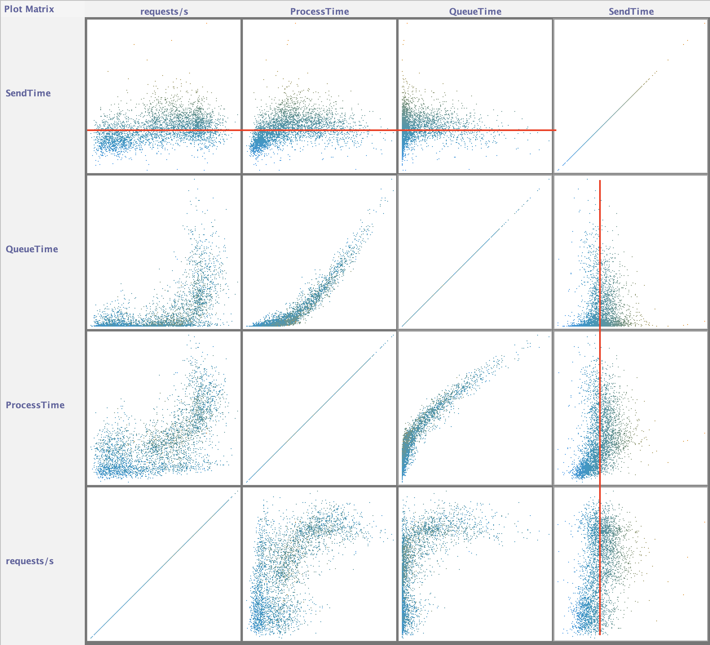
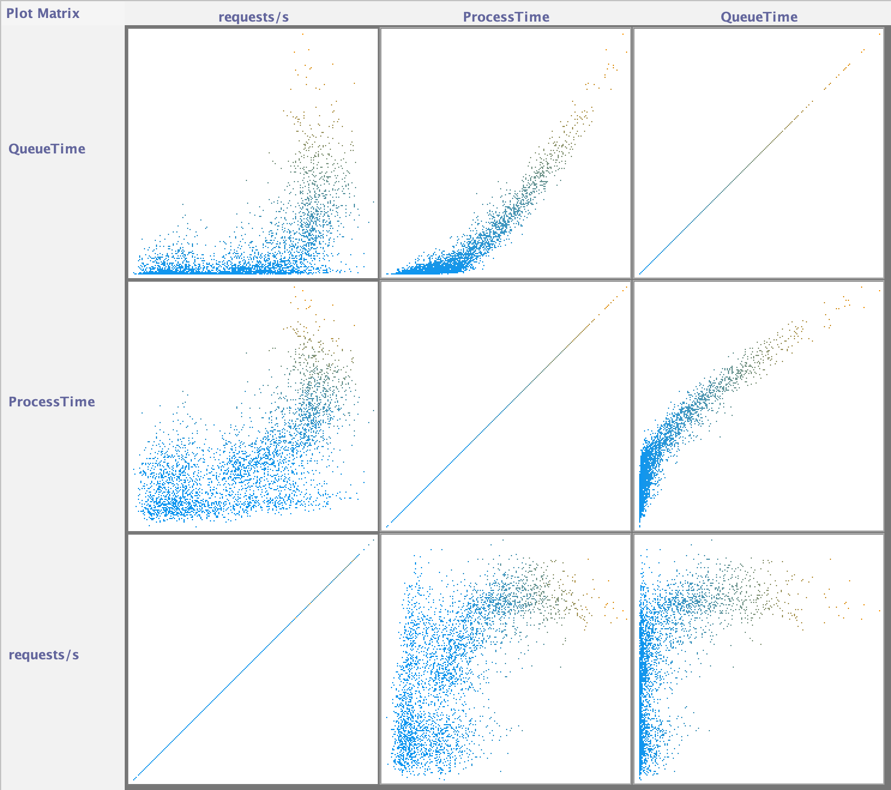
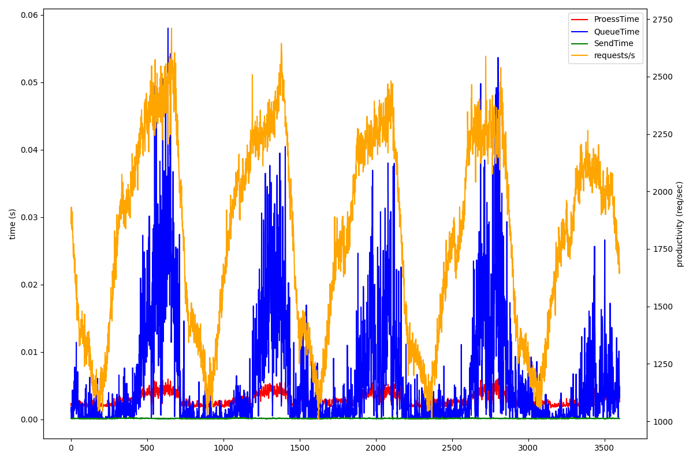
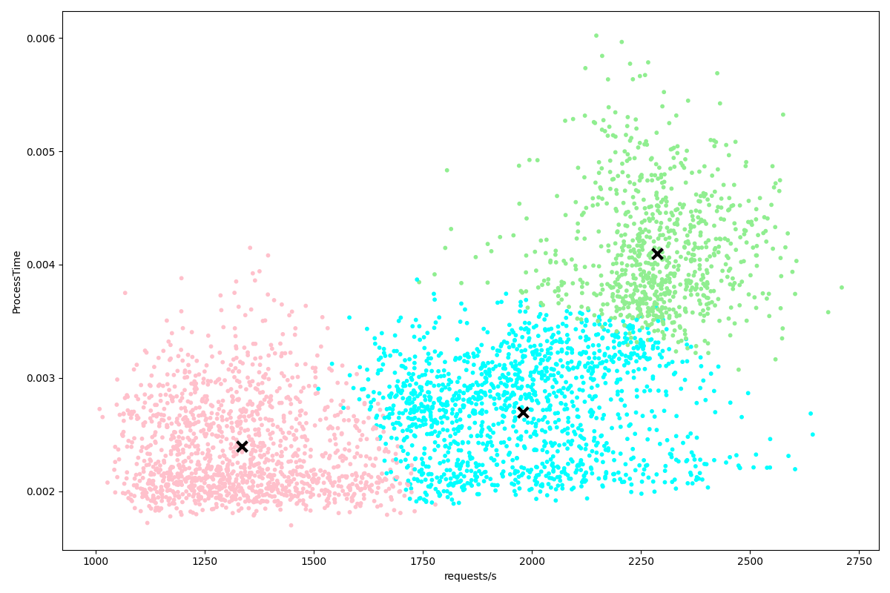
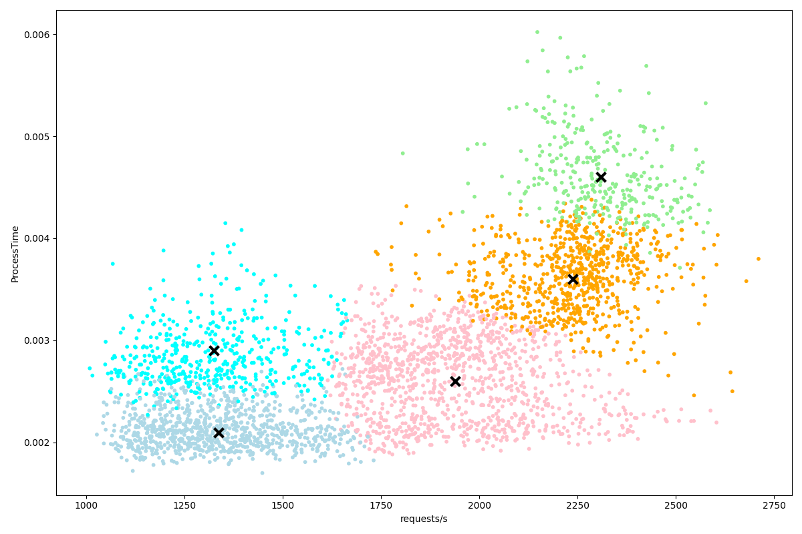
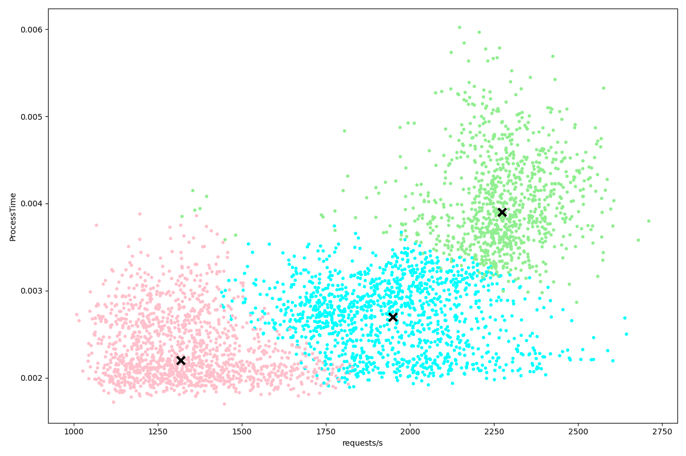
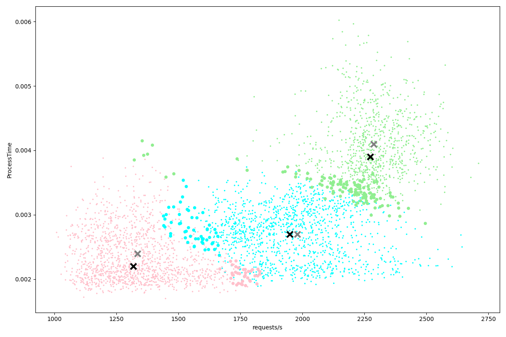

\pagebreak

# ¿Hay alguna característica especial en la carga proporcionada? Explícala con detalle.

Si observamos la matriz de gráficas, dónde se comparan todas las variables, y nos fijamos en la variable `SendTime` podemos observar que no parece depender de ninguna otra variable porque todos los puntos están cerca del mismo valor en todas las gráficas (líneas rojas en la imagen). Esto significa que la variable `SendTime` no nos aporta nada, por lo que la podemos descartar y obviar en el análisis.

\pagebreak

Para el resto de variables, podemos ver como `ProcessTime` y `QueueTime` responden de forma muy similar a `requests/s`: se mantienen estables hasta un cierto punto dónde se disparan (el sistema se satura por lo que estos tiempos incrementan). Como `ProcessTime` y `QueueTime` son dependientes de `requests/s` no tiene sentido compararlas entre ellas. De hecho, en las gráficas comparativas entre estas dos variables se aprecia como los puntos están muy agrupados y forman una línea casi recta.

\pagebreak

Finalmente podemos analizar la gráfica de todas las variables respecto al tiempo de medición. Se observa un comportamiento cíclico dónde la variable `requests/s` aumenta y disminuye lo que provoca que el resto de variables excepto `SendTime` a seguir el mismo patrón.

Como el patrón se repite 5 veces y el número de muestras es un múltiplo de 60, mi sospecha es que el patrón se repite cada día. Tiene sentido que sean 5 días porque es exactamente una jornada laboral y el comportamiento de la carga coincide con lo que esperaríamos de una semana laboral normal: la demanda (peticiones por segundo) es mayor el Lunes y Martes, y va disminuyendo hasta llegar al Viernes que es el día con menos demanda por ser el último día laboral de la semana.

A partir de esta suposición también podríamos obtener el intervalo de tiempo entre muestras:

$$
\frac{3600 \mathit{muestras}}{5 \mathit{dias}} \cdot \frac{1 \mathit{dia}}{24 \mathit{horas}} \cdot \frac{1 \mathit{hora}}{60 \mathit{minutos}} = \frac{1 \mathit{muestra}}{2 \mathit{minutos}}
$$

\pagebreak

# Aplicando el algoritmo con 100 iteraciones y agrupando los datos en 3 clases, ¿qué resultados se obtienen? Muéstralo gráficamente.

Como `ProcessTime` y `QueueTime` tienen el mismo comportamiento respecto a `requests/s` (la carga del sistema) he decidido trabajar sólo sobre una variable. En concreto, he elegido `ProcessTime` porque los puntos están más dispersos y se puede apreciar mejor los diferentes grupos.

Los centroides son los siguientes:

| clúster | requests/s | ProcessTime | QueueTime | SendTime |
|---------|------------|-------------|-----------|----------|
| rosa    | 1334.5201  | 0.0024      | 0.0013    | 0.0001   |
| azul    | 1978.8568  | 0.0027      | 0.0026    | 0.0001   |
| verde   | 2286.4463  | 0.0041      | 0.0185    | 0.0001   |

Vemos tres clústers muy claros (con una separación muy definida; no hay zonas con muchos puntos de varios clústers). El único problema para caracterizar la carga sería el clúster verde que esta justo encima del azul y no hay una separación clara sobre el eje horizontal. Quizás lo que se podría hacer es calcular el punto intermedio entre los centroides de estos clústers para determinar un punto de separación.

\pagebreak

# Con el mismo número de iteraciones y agrupando los datos en 5 clases, ¿qué resultados se obtienen? ¿Cómo difieren de los anteriormente obtenidos?

Los centroides son los siguientes:

| clúster | requests/s | ProcessTime | QueueTime | SendTime |
|---------|------------|-------------|-----------|----------|
| azul    | 1324.4458  | 0.0029      | 0.0029    | 0.0001   |
| gris    | 1336.1735  | 0.0021      | 0.0004    | 0.0001   |
| rosa    | 1937.8234  | 0.0026      | 0.0017    | 0.0001   |
| naranja | 2237.3672  | 0.0036      | 0.0106    | 0.0001   |
| verde   | 2308.9958  | 0.0046      | 0.0271    | 0.0001   |

Tenemos dos solapamientos bastante completos (centroides tienen casi el mismo valor de `requests/s`): el azul con el rosa, y el verde con el gris. En estos casos lo que haría es juntar los clústers solapados y determinar el nuevo centroide calculando el punto medio entre ambos centroides. Como en el apartado anterior, también tenemos un poco de solapamiento en el clúster naranja con los clústers gris y verde.

\pagebreak

# Cambiando la distancia de la Euleriana a la Manhattan, vuelve a aplicar el punto 2. ¿Qué diferencias hay al cambiar la distancia? Muéstralo gráficamente.

Los centroides son los siguientes:

| clúster | requests/s | ProcessTime | QueueTime | SendTime |
|---------|------------|-------------|-----------|----------|
| rosa    | 1318.2887  | 0.0022      | 0.0003    | 0.0001   |
| azul    | 1948.3173  | 0.0027      | 0.0015    | 0.0001   |
| verde   | 2274.1332  | 0.0039      | 0.0148    | 0.0001   |

En la siguiente gráfica se muestra la diferencia entre el método de la distancia Euleriana y el método de la distancia Manhattan. Los colores indican el clúster de la distancia Manhattan, los puntos pequeños son los puntos cuyos clústers coinciden para ambos métodos, los puntos grandes los puntos cuyos clústers no coinciden entre los dos métodos, las X grises los centroides de la distancia Euleriana y las X negras los centroides de la distancia Manhattan.

Se ve claramente como la mayoría de puntos que han cambiado de clúster están justo en el borde entre dos clústers, pero hay varios puntos que estan bastante lejos del clúster final (puntos del clúster verde encima del clúster rosa), por lo que parece que la distancia Manhattan tiende a dispersarse más que la Euleriana. Debido a esto, los centroides finales también se han movido ligeramente.
