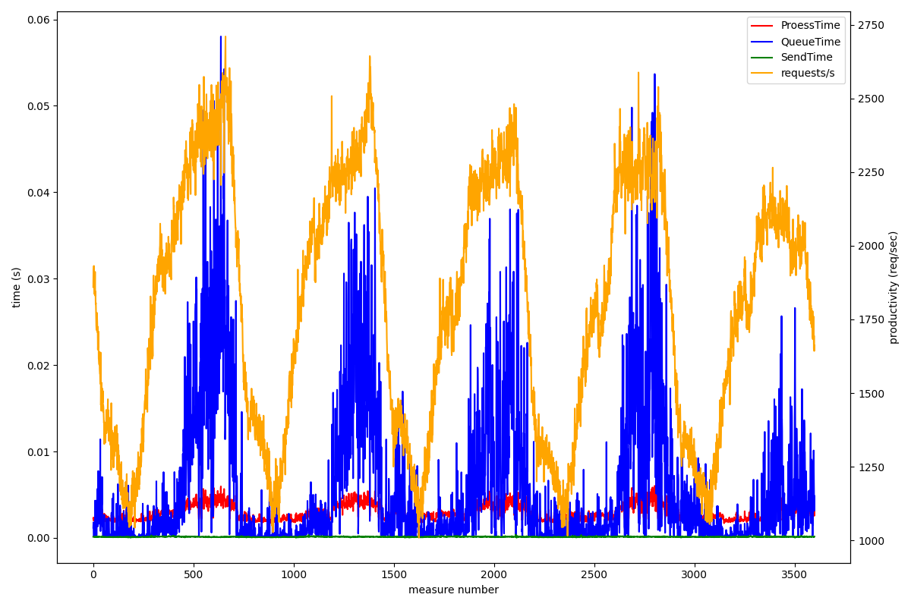
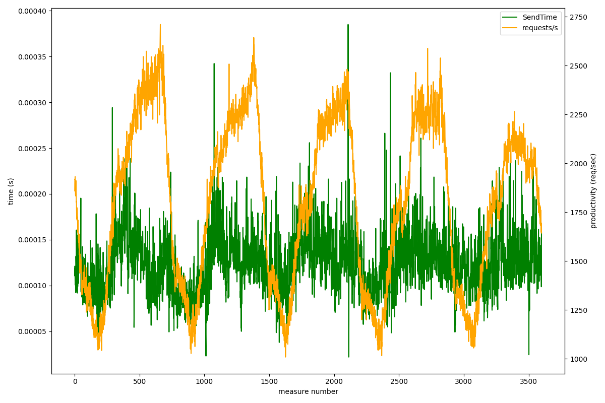

\pagebreak

# ¿Qué patrón siguen los datos monitorizados? Justifica la respuesta y proporciona una representación gráfica.

Podemos analizar la gráfica de todas las variables respecto al tiempo de medición. Se observa un comportamiento cíclico dónde la variable `requests/s` aumenta y disminuye lo que provoca que el resto de variables excepto `SendTime` a seguir el mismo patrón.

Debido a que la variable `SendTime` tiene valores muy bajos, el patrón no se aprecia en una gráfica con rangos tan grandes. Si la representamos en una gráfica con sólo `SendTime` y `requests/s` se aprecia el patrón immediatamente:

Como el patrón se repite 5 veces y el número de muestras es un múltiplo de 60, mi sospecha es que el patrón se repite cada día. Tiene sentido que sean 5 días porque es exactamente una jornada laboral y el comportamiento de la carga coincide con lo que esperaríamos de una semana laboral normal: la demanda (peticiones por segundo) es mayor el Lunes y Martes, y va disminuyendo hasta llegar al Viernes que es el día con menos demanda por ser el último día laboral de la semana.

A partir de esta suposición también podríamos obtener el intervalo de tiempo entre muestras:

$$
\frac{3600 \mathit{muestras}}{5 \mathit{dias}} \cdot \frac{1 \mathit{dia}}{24 \mathit{horas}} \cdot \frac{1 \mathit{hora}}{60 \mathit{minutos}} = \frac{1 \mathit{muestra}}{2 \mathit{minutos}}
$$

\pagebreak

# Calcula los valores solicitados haciendo uso de la regresión lineal, medias móviles (últimos 70 valores), medias móviles (últimos 500 valores), medias móviles (últimos 2000 valores) y suavizado exponencial ($\alpha = 0.6$).

\pagebreak

# ¿Qué técnica de predicción funciona mejor? ¿Por qué? ¿Cuál es la más adecuada para los datos con los que contamos?
