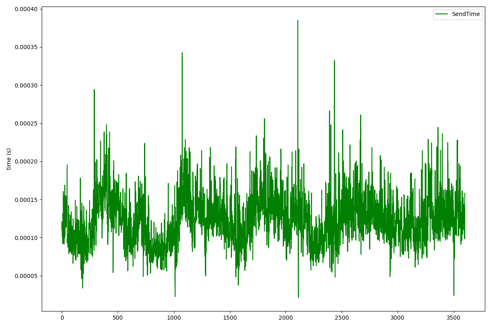
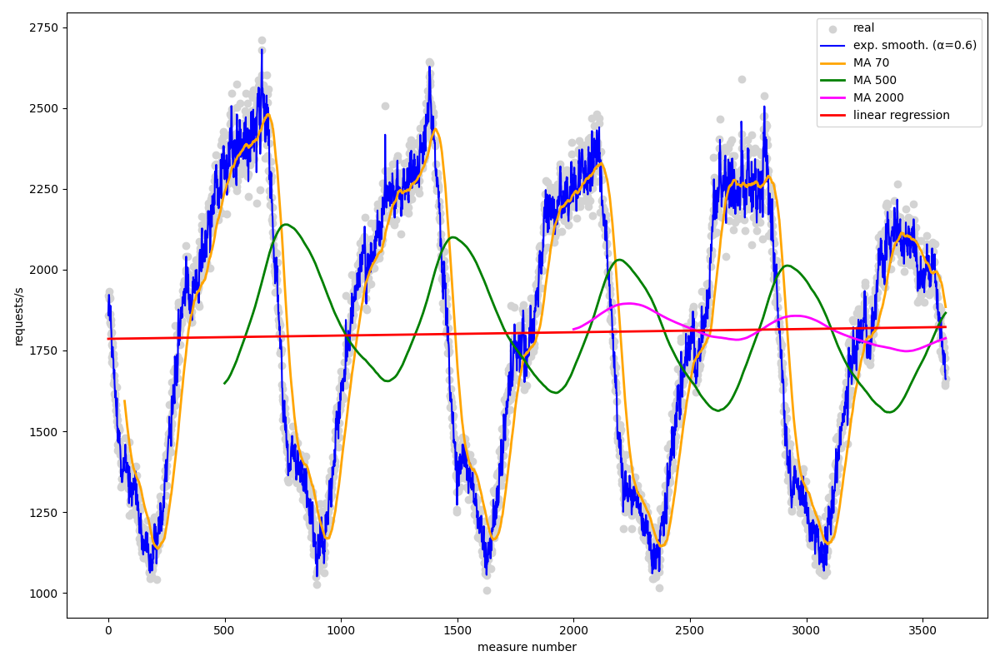
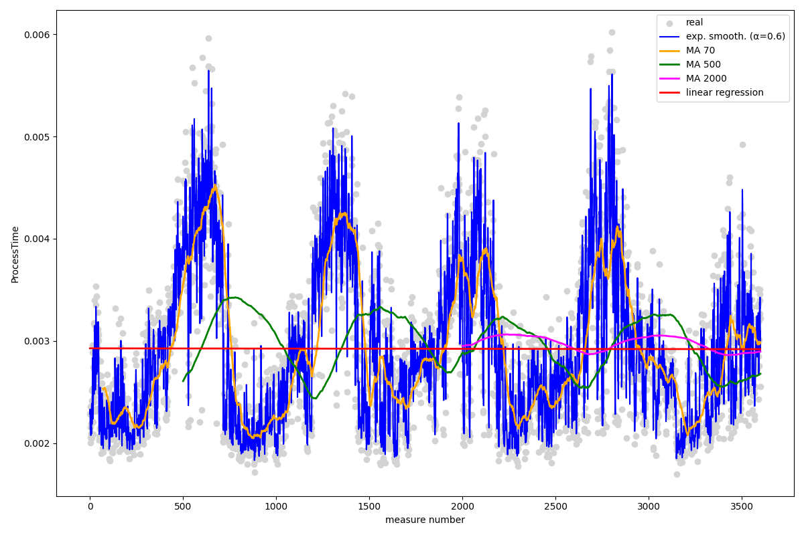
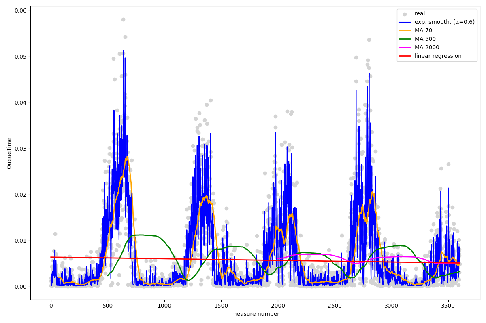
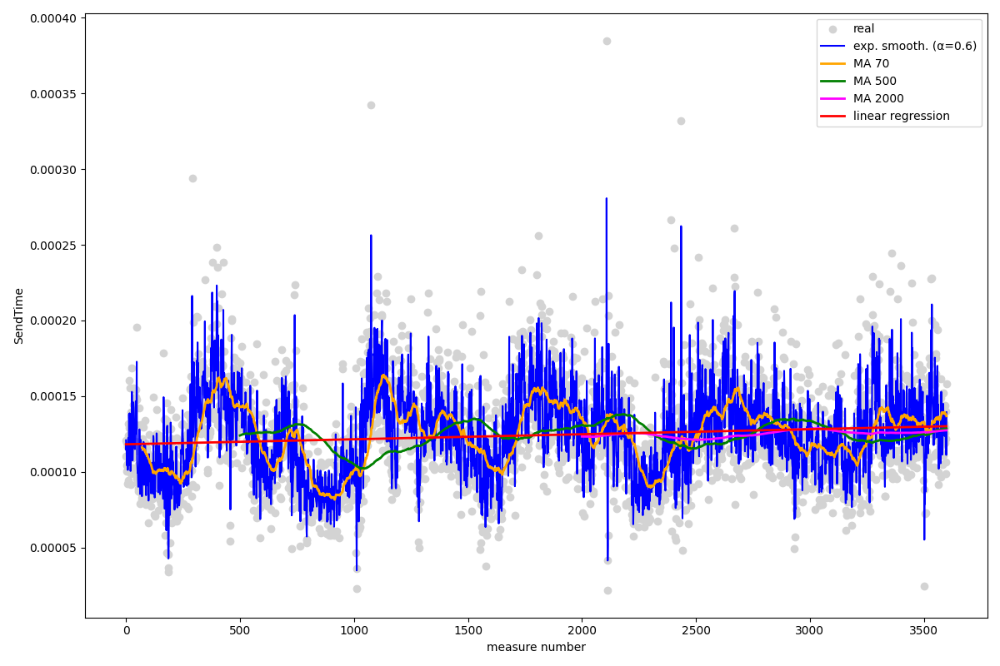

\pagebreak

# ¿Qué patrón siguen los datos monitorizados? Justifica la respuesta y proporciona una representación gráfica.

Podemos analizar la gráfica de todas las variables respecto al tiempo de medición. Se observa un comportamiento cíclico dónde la variable `requests/s` aumenta y disminuye lo que provoca que el resto de variables excepto `SendTime` a seguir el mismo patrón.

Debido a que la variable `SendTime` tiene valores muy bajos, el patrón no se aprecia en una gráfica con rangos tan grandes. Si la representamos en una gráfica con sólo `SendTime` y `requests/s` se aprecia un patrón estacionario:

\pagebreak

# Calcula los valores solicitados haciendo uso de la regresión lineal, medias móviles (últimos 70 valores), medias móviles (últimos 500 valores), medias móviles (últimos 2000 valores) y suavizado exponencial ($\alpha = 0.6$).

**requests/s**

| Método                                 | Predicción t siguiente | Error quadrático medio |
|----------------------------------------|------------------------|------------------------|
| Regresión lineal                       | 1822.5774              | 178165.9870            |
| Media móvil 70                         | 1880.3404              |  27124.8515            |
| Media móvil 500                        | 1866.7238              | 270609.9687            |
| Media móvil 2000                       | 1788.2410              | 183540.6875            |
| Suavizado exponencial ($\alpha = 0.6$) | 1661.4821              |    501.0300            |

\pagebreak

**ProcessTime**

| Método                                 | Predicción t siguiente | Error quadrático medio |
|----------------------------------------|------------------------|------------------------|
| Regresión lineal                       | 0.002920               | 0.0000006613           |
| Media móvil 70                         | 0.002975               | 0.0000003276           |
| Media móvil 500                        | 0.002681               | 0.0000009064           |
| Media móvil 2000                       | 0.002896               | 0.0000006296           |
| Suavizado exponencial ($\alpha = 0.6$) | 0.003094               | 0.0000000328           |

\pagebreak

**QueueTime**

| Método                                 | Predicción t siguiente | Error quadrático medio |
|----------------------------------------|------------------------|------------------------|
| Regresión lineal                       | 0.005092               | 0.0000711174           |
| Media móvil 70                         | 0.004731               | 0.0000356589           |
| Media móvil 500                        | 0.003267               | 0.0000978370           |
| Media móvil 2000                       | 0.005126               | 0.0000648844           |
| Suavizado exponencial ($\alpha = 0.6$) | 0.004829               | 0.0000041524           |

\pagebreak

**SendTime**

| Método                                 | Predicción t siguiente | Error quadrático medio |
|----------------------------------------|------------------------|------------------------|
| Regresión lineal                       | 0.0001300              | 0.000000001071         |
| Media móvil 70                         | 0.0001368              | 0.000000000845         |
| Media móvil 500                        | 0.0001288              | 0.000000001170         |
| Media móvil 2000                       | 0.0001274              | 0.000000001013         |
| Suavizado exponencial ($\alpha = 0.6$) | 0.0001393              | 0.000000000138         |

\pagebreak

# ¿Qué técnica de predicción funciona mejor? ¿Por qué? ¿Cuál es la más adecuada para los datos con los que contamos?

La mejor técnica de predicción es el suavizado exponencial con $\alpha = 0.6$ porque se ajusta mejor a los datos reales; paarece responder de forma mucho más rápida a cambios en los datos reales que el resto de técnicas.

De forma gráfica ya se puede apreciar que la regresión lineal es la peor de las técnicas porque los datos són cíclicos y no siguen una tendencia (que es dónde funciona mejor este método; la "dirección general"). Para `SendTime` no hay tanta diferencia con el resto de métodos,
