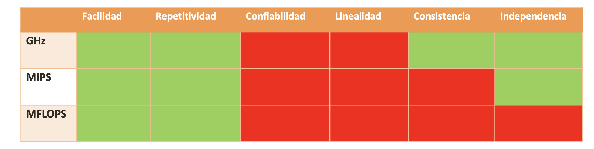
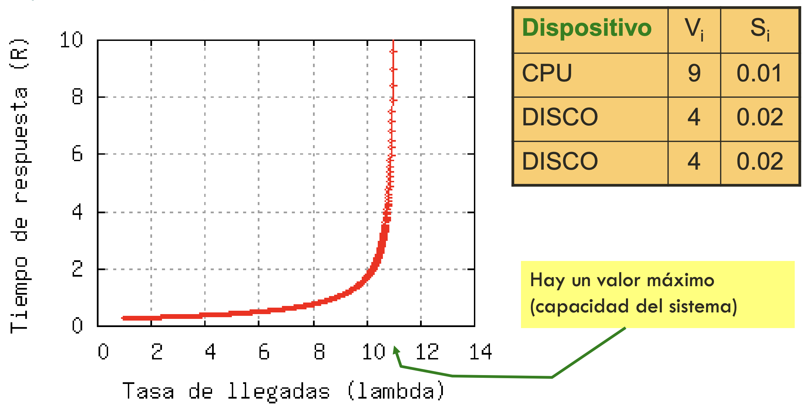
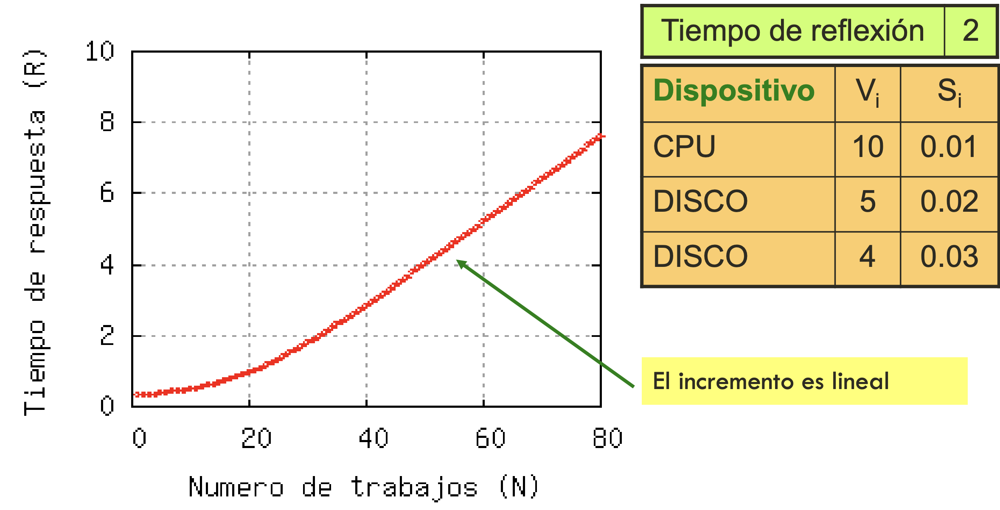
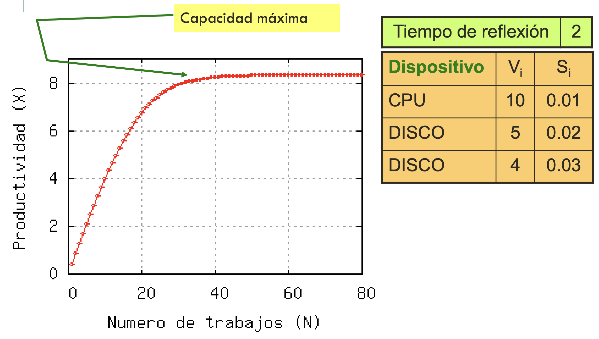
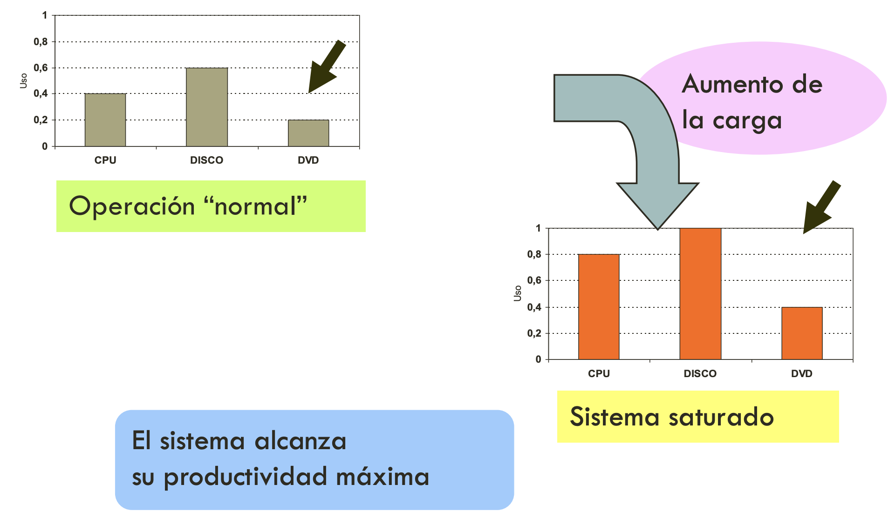
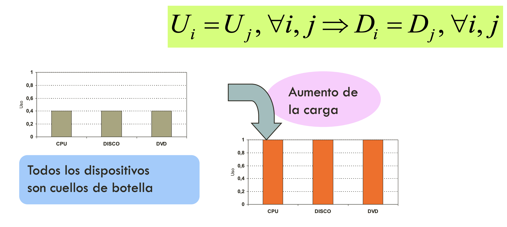
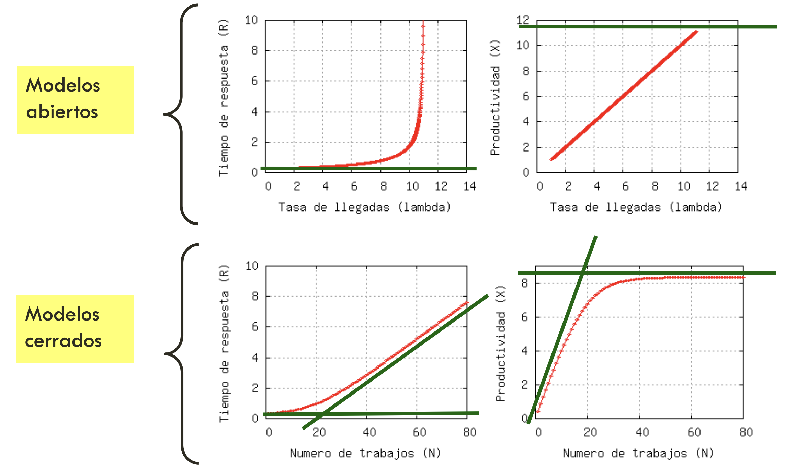
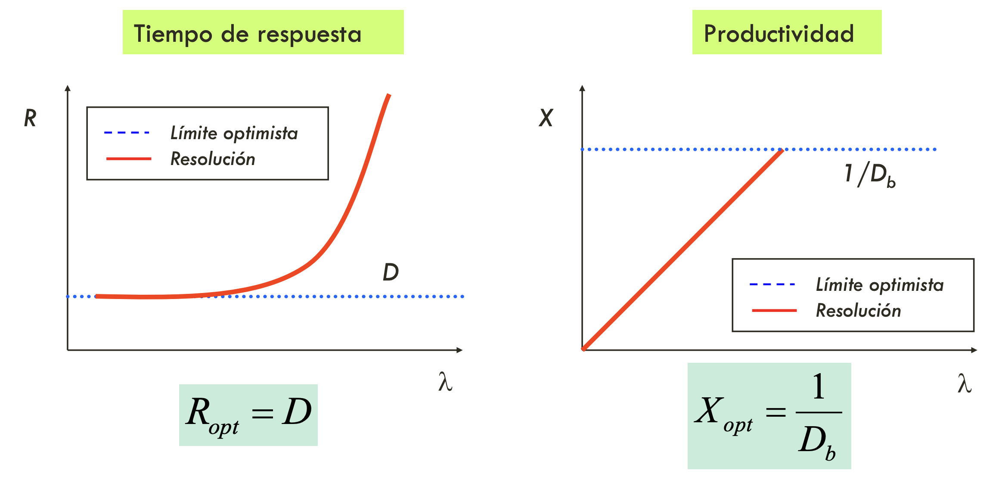
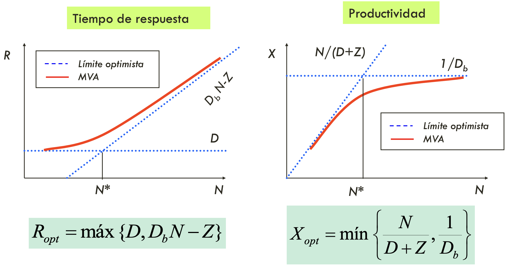

\pagebreak

# Tema 1

$$
\text{Aceleracion} = \frac{T_B}{T_A}
$$

por convención $T_B > T_A$ tal que $\frac{T_B}{T_A} = 1 + \frac{n}{100}$ dónde $n$ es el porcentaje de incremento.

$$
\text{Cambio relativo}_{B,A} = \frac{T_B - T_A}{T_A}
$$

**Ley de Amdhal**

$$
\text{Aceleracion} = \frac{T_{\text{original}}}{T_{\text{mejorado}}} = \frac{s+p}{s + \frac{p}{k}} = \frac{1}{1 - p + \frac{p}{k}}
$$

$$
\text{Aceleracion maxima} = \lim_{k \to \infty} {\frac{1}{s + \frac{p}{k}}} = \frac{1}{s + 0} = \frac{1}{s}
$$

$$
\text{Aceleracion general} = \frac{1}{(1 - \sum\limits_{i=1}^{n}{p_i}) + \sum\limits_{i=1}^{n}{\frac{p_i}{k_i}}}
$$

**Ley de Gustafson**

$$
\text{Aceleracion} = \frac{T_{\text{secuencial}}}{T_{\text{paralelo}}} = \frac{s + p \cdot k}{s + p} = \frac{s + p \cdot k}{1} = s + p \cdot k
$$

Amdhal es la versión pesimista y Gustafson es optimista. La realidad normalmente esta entre las dos.

$$
\text{Eficiencia}(k) = \frac{\text{Aceleracion}}{k}
$$

$$
\text{Eficiencia}_W = \frac{\text{Tiempo de trabajo efectivo}}{\text{Tiempo de trabajo total}} = \frac{W}{W + \mathit{Ov}} = \frac{1}{1 + \frac{\mathit{Ov}}{W}}
$$

$$
\frac{\text{Rendimiento}}{\text{Coste}} = \frac{\frac{1}{T}}{C} = \frac{1}{T \cdot C}
$$

$$
\text{Energia consumida} = \text{Potencia} \cdot \text{Tiempo} = \left[ Ws \right]
$$

$$
\mathit{EDP} = \text{Energia consumida} \cdot \text{Tiempo} = \text{Potencia} \cdot \text{Tiempo}^2 = \left[ Ws^2 \right]
$$

\pagebreak

# Tema 2

Monitorización por:

- Eventos: sólo se guardan datos cuando ocurre un evento
- Rastreo (tracing): igual que eventos pero guardando más información (normalmente el estado)
- Muestreo (sampling): guardar información en intervalos de tiempo regulares
- Medición indirecta: cuando no se puede medir observando eventos (calcular a partir de datos medibles)

Atributos de monitores:

- Interferencia o sobrecarga (overhead)
- Precisión (calidad de medida)
- Resolución (frecuencia de medida)
- Ámbito o dominio de medida (que mide)
- Anchura (bits de información)
- Capacidad de sístensis de datos
- Coste
- Facilidad de instalación y uso

Tipos de monitores:

- Software (programas instalados en el sistema)
- Hardware (dispositivos externos al sistema)
- Híbridos (combinación de los dos anteriores)

$$
\text{Sobrecarga} = \frac{\text{Tiempo de ejecucion del monitor}}{\text{Intervalo de medida}}
$$

```
|                           |                           |
|------|--------------------|------|--------------------|
|                           |                           |

|------| -> Tiempo de ejecución del monitor

       |--------------------| -> Tiempo de ejecución del programa a monitorizar

|---------------------------| -> Intervalo de monitorización
```

\pagebreak

# Tema 3

## Medida y rendimiento

+---------------------+----------------------+
| Dispositivo         | Medida               |
+=====================+======================+
| CPU                 | MIPS                 |
|                     | FLOPS                |
|                     | CPU                  |
|                     | Tiempo de ejecución  |
+---------------------+----------------------+
| Memoria Principal   | Lecturas/s           |
|                     | Escrituras/s         |
|                     | Teimpo de espera     |
|                     | Tiempo de lectura    |
|                     | Tiempo de escritura  |
+---------------------+----------------------+
| E/S                 | Lecturas/s           |
|                     | Escrituras/s         |
|                     | Teimpo de espera     |
|                     | Tiempo de lectura    |
|                     | Tiempo de escritura  |
+---------------------+----------------------+
| Red de comunicación | Paquetes enviados/s  |
|                     | Latencia             |
|                     | Retraso (delay)      |
|                     | Fluctuación (jitter) |

Atributos de la calidad de medida:

- Fácil de medir
- Repetible
- Confiable: resultados seguros
- Lineal: valores de mediciones linealmente proporcionales
- Consistente: mismas un idades entre diferentes sistemas medidos
- Independiente: no esta influenciada: no esta influenciada

$$
\text{Tiempo de CPU} = \text{Ciclos de CPU} \cdot \text{Tiempo de ciclo de reloj} = \frac{\text{Ciclos de CPU}}{\text{Frecuencia de reloj}}
$$

CPI (Cycles Per Instruction):
$$
\mathit{CPI} = \frac{\text{Ciclos de CPU}}{\text{Numero de instrucciones}}
$$

Cada tipo de instrucción necesita un diferente numero de ciclos. Por ejemplo:

| Tipo instrucciónn | Frecuencia aparición ($f_i$) | Tiempo ejecución en ciclos ($t_i$) |
|-------------------|------------------------------|------------------------------------|
| Store             | 0.12                         | 2                                  |
| Load              | 0.21                         | 2                                  |
| ALU               | 0.43                         | 1                                  |
| Jump              | 0.24                         | 2                                  |

Con $\sum\limits_{i=1}^{n}{f_i} = 1 \implies 0.12 + 0.21 + 0.43 + 0.24 = 1$

$$
\mathit{CPI} = \sum\limits_{i=1}^{4}{t_i \cdot f_i} = 0.12 \cdot 2 + 0.21 \cdot 2 + 0.43 \cdot 1 + 0.24 \cdot 2 = 1.57
$$

$$
\text{Tiempo de CPU} = \text{Numero de instrucciones} \cdot \text{CPI} \cdot \text{Tiempo ciclo de reloj} \implies \frac{\text{Numero de instrucciones}}{\text{Tiempo de CPU}} = \frac{\text{Frecuencia de reloj}}{\text{CPI}}
$$

## Índices de rendimiento

MIPS (million of instructions per second):
$$
\mathit{MIPS} = \frac{\text{Instrucciones ejecutadas}}{\text{Tiempo de ejecución} \cdot 10^6} = \frac{\text{Frecuencia de reloj CPU}}{\mathit{CPI} \cdot 10^6}
$$

MIPS relativos (referidos a una máquina de referencia; normalización):
$$
\mathit{MIPS_{relativos}} = \frac{\text{Tiempo de referencia}}{\text{Tiempo de ejecución}} \cdot \mathit{MIPS_{referencia}}
$$

MFLOPS (millioin of floating-point operations per second):
$$
\mathit{MFLOPS} = \frac{\text{Operaciones de coma flotante ejecutadas}}{\text{Tiempo de ejecución} \cdot 10^6}
$$

Hay diferentes tipos de operaciones de coma flotante que tienen un coste diferente, por ejemplo:

- suma, resta, multiplicación, comparación, negación: poco costosas
- división, raíz cuadrada: costosas
- trigonométricas: muy costosas

Por lo que se pueden normalizar:

- ADD, SUB, COMPARE, MUL -> 1 operación normalizada
- DIV, SQRT -> 4 operaciones normalizadas
- EXP, SIN, ATAN -> 8 operaciones normalizadas

Los MFLOPS normalizados serían la suma ponderada de la cantidad de cada tipo de instrucción por su coste normalizado dividido por el tiempo de ejecución. Por ejemplo supongamos que se ejecutan 109970178 operaciones de coma flotante y 15682333 de las cuales son divisiones:

$$
\mathit{MFLOPS} = \frac{109970178}{94 \cdot 10^6} = 1.2
$$

$$
\mathit{MFLOPS_{normalizados}} = \frac{(109970178 - 15682333) \cdot 1 + 15682333 \cdot 4}{94 \cdot 10^6} = 1.7
$$



## Aproximaciones

Media aritmética:

$$
\overline{x} = \frac{1}{n} \sum\limits_{i=1}^{n}{x_i}
$$

Media aritmética ponderada:

$$
\overline{x} = \frac{1}{n} \sum\limits_{i=1}^{n}{x_i \cdot w_i} \text{, con } \sum\limits_{i=1}^{n}{w_i} = 1
$$

- Útil para tiempos de respuesta
- No se ha de utilizar con frecuencias
- Se recomienda normalizar el resultado en lugar de cada $x_i$

Media armónica:

$$
\overline{x} = \frac{n}{\sum\limits_{i=1}^{n}{\frac{1}{x_i}}}
$$

Media armónica ponderada:

$$
\overline{x} = \frac{n}{\sum\limits_{i=1}^{n}{\frac{w_i}{x_i}}} \text{, con } \sum\limits_{i=1}^{n}{w_i} = 1
$$

- Útil para frecuencias o unidades de tiempo en el denominador (MIPS, MFLOPS)
- No se ha de utilizar con tiempos de respuesta
- Se recomienda normalizar el resultado en lugar de cada $x_i$

Media geométrica:

$$
\overline{x} = \left( \prod\limits_{i=1}^{n}{x_i} \right)^{\frac{1}{n}}
$$

Media geométrica ponderada:

$$
\overline{x} = \prod\limits_{i=1}^{n}{x_i^{w_i}} \text{, con } \sum\limits_{i=1}^{n}{w_i} = 1
$$

- No es útil ni para tiempos de respuesta ni para frecuencias
- Única virtud: manitene el mismo orden en las comparaciones con valores normalizados (consistencia)

## Referenciación (benchmarking)

$$
\frac{R_A}{R_B} = \frac{T_B}{T_A} = 1 + \frac{n}{100} \text{, o también,} \frac{R_A - R_B}{R_B} \cdot 100 = n
$$

## Estrategias de análisis

Recomendaciones para las medias:

- Tiempos: media aritmética
- Frecuencias o velocidades: media armónica
- Índices de rendimiento: media geométrica (a riesgo de reordenar los resultados)
- Porcentajes: media artimética
- Tiempos: primero se hace la media aritmética y luego se normaliza
- Valores muy extremos: se eliminan los extremos (si se puede) y luego se hace la media aritmética

\pagebreak

# Tema 4

$$
\text{Tiempo de respuesta} = \text{Tiempo de espera} + \text{Tiempo de servicio}
$$

- $T$: duración del periodo de medida
- $N$: numero de trabajos en el sistema
- $Z$: timepo de reflexión (think time)
- $A_i$: numero de trabajos que llegan (arrivals)
- $C_i$: numero de trabajos que se van (completions)
- $B_i$: tiempo de ocupación (busy time)
- $\lambda_i = \frac{A_i}{T}$: tasa de llegadas (arrival rate)
- $X_i = \frac{C_i}{T}$: productividad (throughput)
- $S_i = \frac{B_i}{C_i}$: tiempo de servicio (service time)
- $V_i = \frac{C_i}{C_0}$: razón de visita (visit ratio)
- $U_i = \frac{B_i}{T}$: utilización (utilization)
- $D_i = V_i \cdot S_i$: demanda de servicio (service demand)
- $W_i$: timepo de espera en cola (waiting time) 
- $Q_i$: trabajos en cola de espera (waiting customers)
- $R_i = W_i + S_i$: tiempo de respuesta (response time)
- $N_i = Q_i + U_i$: trabajos en toda la estación (cola más servidor)
- $\lambda_0 = \frac{A_0}{T}$: tasa de llegadas del sistema
- $X_0 = \frac{C_0}{T}$: productividad del sistema

## Hipótesis del equilibrio de flujo

- Supone que el sistema trabaja en estado estable (estacionario, no transitorio)
- El sistema cumple el supuesto de equilibrio de flujo si para cada dispositivo: $\lambda_i = X_i$ o bien $A_i = C_i$
- Para intervalo de observación suficientemente largos:

$$
\left| \frac{A_i - C_i}{C_i} \right| \approx 0
$$

$$
A_i = C_i \implies \lambda_i = X_i
$$

## Ley de Little

$$
N_i = \lambda_i \cdot R_i = X_i \cdot R_i
$$

$$
Q_i = \lambda_i \cdot W_i = X_i \cdot W_i
$$

## Ley de la utilización

$$
U_i = \frac{B_i}{T} = \frac{C_i}{T}\frac{B_i}{C_i} = X_i S_i \implies U_i = X_i S_i
$$

$$
U_i = \lambda_i S_i = X_i S_i
$$

## Ley del flujo forzado

$$
V_i = \frac{C_i}{C_0} \implies C_i = C_0 V_i \implies \frac{C_i}{T} = \frac{C_0}{T} V_i \implies X_i = X_0 V_i
$$

$$
U_i = X_i S_i = X_0 V_i S_i = X_0 D_i
$$

## Ley general del tiempo de respuesta

En general

$$
R \neq \sum\limits_{i=1}^{K}{R_i}
$$

En particular

$$
R = \sum\limits_{i=1}^{K}{V_i R_i}
$$

## Ley del tiempo de respuesta interactiva

- $N_Z = X Z$: cantidad de trabajos reflexionando
- $N_R = X R$: cantidad de trabajos trabajando

$$
N = N_Z + N_R = XZ + XR = X(Z + R) \implies R = \frac{N}{X} - Z
$$

\pagebreak

# Tema 5

$$
R_i = (N_i + 1)S_i = (X_i R_i + 1) S_i \implies R_i = \frac{S_i}{1 - X_i S_i} = \frac{S_i}{1 - U_i}
$$

Resolución de redes abiertas

$$
U_i = X_i S_i = \lambda V_i S_i
$$

$$
R_i = \frac{S_i}{1 - U_i}
$$

$$
R = \sum\limits_{i=1}^{k}{V_i R_i} = \sum\limits_{i=1}^{k}{\frac{V_i S_i}{1 - U_i}}
$$



## Resolución redes cerradas





$$
R_i(n) = (N_i(n - 1) + 1) S_i \text{, con} N_i(0) = 0
$$

$$
R(n) = \sum\limits_{i=1}^{k}{V_i R_i(n)}, X(n) = \frac{n}{Z + R(n)}
$$

$$
N_i(n) = X(n) V_i R_i(n)
$$

$$
X_i(n) = X(n) V_i
$$

$$
U_i(n) = X(n) V_i S_i
$$

## Límites optimistas del rendimiento



<!--  -->

Localización del cuello de botella:

$$
D_b = \max\limits_{i=1,\ldots,k}{D_i} = \max\limits_{i=1,\ldots,k}{V_i S_i} = V_b S_b
$$

$$
U_b = \max\limits_{i=1,\ldots,k}{U_i} = \max\limits_{i=1,\ldots,k}{X_i S_i} = X_b S_b = X V_b S_b = X D_b
$$

$$
D = \sum\limits_{i=1}^{k}{D_i}
$$

**Sistemas abiertos**

$$
U_b = X_b S_b = X D_b = \lambda D_b
$$

$$
U_b = 1 \implies \lambda D_b = 1 \implies \lambda = \frac{1}{D_b}
$$

$$
X_{opt} = \frac{1}{D_b}
$$

$$
R_{opt} = \sum\limits_{i=1}{k}{D_i} = D
$$



**Sistemas cerrados**

$$
R_{opt} = \sum\limits_{i=1}{k}{D_i} = D
$$

$$
R_{opt} = \frac{N}{X_{opt}} - Z \implies X_{opt} = \frac{N}{D + Z}
$$

$$
R_{opt} = \frac{N}{X_{opt}} - Z \implies R_{opt} = N D_b - Z
$$

Punto teórico de saturación $N^*$:

$$
D = N D_b - Z \implies N = \frac{D + Z}{D_b} \implies N^* = \left\lceil \frac{D + Z}{D_b} \right\rceil
$$



## Técnicas de mejora

1. Actualización (upgrading): Reemplazar dispositivos por otros más rápidos, añadir más dispositivos para realizar más tareas en paralelo, etc
2. Ajuste (tuning): optimizar el funcionamiento de todos los componentes, muchos ajustes se hacen en el sistema operativo